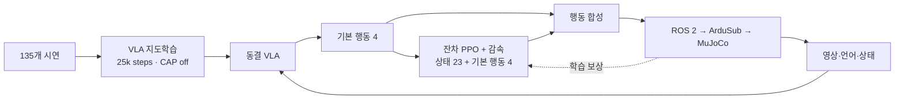
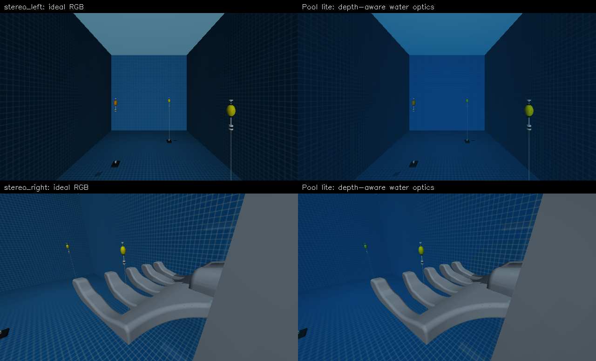

# KMU26 Underwater ROV Simulator

**MuJoCo · ArduSub SITL · ROS 2 Humble · U0 VLA · Residual PPO**

10 × 5 × 5 m 연구용 수영장, 전방·손 카메라, DVL·IMU·수심 센서와 부표·자석·줄 접촉을 통합한 ROV 연구 환경입니다. 웹 GUI에서 조종하고 시연을 기록해 LeRobot/U0 학습 입력으로 내보낼 수 있습니다.

**최신 연구 구현 · 2026.09.22** · [전체 변경·검증 기록](docs/UUV_UPDATE_20260922.md) · [인터랙티브 설명](docs/interactive/uuv-learning.html) · [설치 안내](README_FIRST.md)

[노션 최신 장 · 실제 영상과 내장 인터랙티브 자료](https://app.notion.com/p/3e3ad8acb9a181379c13c5baff275496) · [게시 전 검사와 배포 범위](docs/versions/2026.09.22.md)

## 수집 준비 → 실제 VLA 학습 → 잔차 PPO

성공 라벨 시연 **135개 / 14,522프레임**, 검토 구간 **1.1배**로 U0 기반 VLA를 **25,000스텝** 학습했습니다. CAP을 제외한 VLA는 PPO 중 고정하고, 별도 잔차 정책이 행동 보정과 감속을 학습합니다. VLA 본체의 PPO 미세조정 또는 CAP 대체 성능 입증이 아닙니다.



| 실제 전방 카메라 | 실제 손 카메라 |
|---|---|
|  |  |

[두 카메라 정책 실행 영상 · 4.9초 MP4](docs/assets/uuv-update-20260922/dual-camera-rollout.mp4). 실제 학습 실행의 저장 프레임입니다. 두 정지 이미지는 서로 다른 시점이며 결과는 **손 시야 분리이지 정밀 포크 분리가 아닙니다.** 생성 이미지나 실로봇 영상이 아닙니다. [원본 출처](docs/assets/uuv-update-20260922/README.md)

- **2+3 병렬 구성:** 일반 분리 seed 2환경, 정밀 후보 seed 3환경. VLA 추론만 공유하고 두 PPO 정책·경험·optimizer는 분리합니다. 오류 발생 시 활성 수는 줄어들 수 있습니다.
- **정밀 보상:** 접근·좌우/높이 정렬·진입 방향 조준·삽입 근접 점수를 연속적으로 반영하고 반복 진척 보상과 근거리 과속을 억제합니다.
- **평가 후 승인:** 학습 수집 → PPO → 기존/후보 각각 2회 평가. 성공 지표가 개선되어야 승격하며 전부 실패한 보상 상승만으로 승인하지 않습니다.
- **추적·운영:** 학습/평가 곡선, 보상 항목, 승인/수집/업데이트 체크포인트를 구분합니다. 실패 원인 자동 진단·보상 자동 수정은 아직 없습니다.

**실로봇 전이·CAP 동등성·정밀 삽입 일반화는 미검증입니다.** 공개 소스에는 가중치와 원본 학습 데이터가 없으며, 현재 연구 GUI는 로컬 모델과 GPU 환경 설정이 필요합니다. [실행 조건](tools/vla_gui/README.md) · [PPO 상세](tools/rl_training/PRECISION_V3.md)


## 최신 장면과 영상



실제 MuJoCo 전방·손 카메라 렌더입니다. 각 행의 왼쪽은 이상적인 RGB,
오른쪽은 거리별 색 감쇠·산란을 적용한 경량 수중 광학입니다.
카메라 장착·부표·줄·충돌 형상은 유지하며, 광학 계수는 실측 보정 전의 가정입니다.


[MP4 장면 미리보기](docs/assets/research-pool-20260912.mp4). 실제 MuJoCo 렌더러로 촬영한 카메라 회전 영상입니다. 정책 실행이나 실물 전이 성공 영상이 아닙니다.

| 전방 카메라 | 손 카메라 |
|---|---|
|  |  |

## 구현 및 검증 범위

- **환경:** 연구 수영장과 테스트 수조, 실물 bag을 참고한 파란 라이너 재질, 편집 가능한 부표·ROV 위치.
- **물리:** 분산 부력·항력·물살, 리서치 맵 20 N 자석 분리, 충돌을 유지한 6관절 줄. 접힌 줄 및 갈퀴·봉 충돌 회귀 시험과 안정화 수정 포함.
- **제어:** ArduSub SITL → PWM → 추진기, MAVROS RC override, 웹 스틱·브라우저 게임패드 지원.
- **VLA:** 상태 23차원, 행동 4차원 `[surge, sway, heave, yaw]`, 전방·손 카메라, 출처·종료 이유·시각 기록. 정책의 RC 단일 발행자 검사.
- **파이프라인:** 초기 10Hz 정지 연결 검사에서 실제 시연 학습·GPU 추론·잔차 PPO와 독립 평가까지 확장. 현재 구현과 제한은 위 최신 기록을 기준으로 합니다.
- **실물 로그 활용:** 단일 수조 주행 bag으로 제한적인 수평 응답 보정. 별도 opt-in 프로파일이며 기본 모델의 실측 인증이 아닙니다.

**학습 체크포인트와 시뮬레이션 분리 사례는 확인했지만 정밀 삽입 일반화·실물 전이는 검증하지 않았습니다.** 정지 연결 데이터를 유효한 작업 시연으로 사용하지 않습니다. CAD 장착값·유체 계수·센서 광학은 추가 실측이 필요합니다.

## 설치와 실행

지원 기준은 **Linux x86_64, Ubuntu 22.04 / ROS 2 Humble**입니다. Ubuntu 24.04 호스트에서는 22.04 개발 컨테이너를 권장합니다. Windows/macOS 네이티브, ARM, GPU 종류 전체에 대한 호환성은 보장하지 않습니다.

```bash
git lfs install
git clone --recurse-submodules https://github.com/kanghyunmin-bot/ROS2-mujoco-UUVsimulator.git
cd ROS2-mujoco-UUVsimulator
git checkout main
git submodule update --init --recursive
git lfs pull
```

ROS 2 Humble이 설치된 Ubuntu 22.04에서는:

```bash
source /opt/ros/humble/setup.bash
./setup/install_uuv_mujoco.sh --with-ros2 --noninteractive
source ./.uuv_mujoco_env.sh
./run_control_gui.sh --web --sim-preset research_pool_distributed --host 127.0.0.1 --port 8878
```

<http://127.0.0.1:8878/>에서 **Start SITL/MuJoCo → 자세 정렬 완료 확인 → Arm** 순서로 시작합니다.
기본 환경은 **Research pool · distributed physics**입니다. 연구 수조에서
**April Real2Sim** 유효 보정으로 4월 bag 기반의 전후 응답과
검토한 제어 설정을 적용합니다. 보조 bag의 회전·수심 잔차와 적용 범위는
[Real2Sim 적용 결과](docs/contracts/REAL2SIM_APPLICATION_20260915.md)에 기록했습니다.
SITL clock 보정과 실물 반동 비교는 [yaw 응답 검증](docs/contracts/YAW_RELEASE_REAL2SIM_20260915.md)을 참고하세요.
`April yaw candidate`는 반동이 감소하지만 검증 bag의 경로 오차가 커 기본값으로 사용하지 않습니다.
기존 무보정 모델은 `--sim-preset course_current`, 연구 풀 기본 모델은
`--sim-preset research_pool_distributed`로 선택할 수 있습니다.
수집 준비에는 **ROS 센서 출력 → VLA lite (640×360, 15 Hz)**,
**광학 → 수중 풀 · 경량 광학**을 선택하고 시뮬레이션에 적용하세요.
**미리보기 속도**는 이 브라우저의 표시만 바꾸며 원본 센서·녹화 주기를 바꾸지 않습니다.
기본값은 VLA lite 15 Hz입니다. 선택 가능한 4 Hz 설정은 모니터링용이며 레코더 준비가 거절됩니다.
단일 부표·CAP 제외·제어권 전환과 남은 검증은 [녹화/VLA 준비 상태](docs/contracts/VLA_RECORDING_READINESS_20260920.md)를 참고하세요.
레코더 세션이 열린 동안 센서·물리 설정은 잠기며 세션 종료 후 변경할 수 있습니다.
실측 검사와 재현 명령은 [VLA 수집 전 점검](docs/versions/2026.09.14.md)을 참고하세요.

Docker 설치·GPU 설정은 [개발 컨테이너 안내](docker/ubuntu-dev/README.md)를 참고하세요. 활성 코드는 `uuv_mujoco/current`입니다. `.uuv_mujoco_env.sh`와 시스템 장치 권한은 각 PC에서 설정해야 합니다. GitHub 자동 소스 ZIP에는 submodule 및 Git LFS 실파일이 완전하게 포함되지 않을 수 있으므로 위 clone 절차를 사용하세요.

## 데이터 수집과 검증

| 목적 | 문서 |
|---|---|
| 수집기 설정·실행 | [VLA collector](rospkg/src/auv_vla_data_collector/README.md) |
| 정책 어댑터 | [VLA policy](rospkg/src/kmu26_auv_vla_policy/README.md) |
| 실물/시뮬 계약 | [Real stack parity](docs/contracts/REAL_STACK_PARITY.md) |
| 최신 파이프라인 검사 | [Offline hardening](docs/contracts/OFFLINE_HARDENING_20260912.md) |
| 수집 시작·시계 검증 | [Collection readiness](docs/contracts/PRE_VLA_COLLECTOR_READINESS_20260914.md) |
| 실물 로그 보정의 범위 | [Horizontal response](docs/contracts/HORIZONTAL_RESPONSE_CALIBRATION_20260912.md) |
| Real2Sim 적용·독립 bag 재생 | [April Real2Sim](docs/contracts/REAL2SIM_APPLICATION_20260915.md) |
| ROSBAG 위상·경로·노이즈 비교 | [Trend alignment](docs/contracts/ROSBAG_TREND_ALIGNMENT.md) |
| 줄 안정화와 재현 절차 | [Rope stability](docs/gui/ROPE_STABILITY_20260912.md) |
| 센서 장착 가정 | [CAD sensor mounts](docs/gui/CAD_SENSOR_MOUNTS.md) |

`/mujoco/ground_truth/pose` 등 시뮬레이션 정답 토픽은 진단용이며 VLA 실물 입력으로 사용하지 않습니다. RC 명령은 추력이나 결과 움직임과 다른 값입니다. 녹화 세션 단위로 학습·검증 데이터를 분리하세요.

```bash
# MuJoCo·NumPy가 설치된 Python 환경에서, ROS 없이 수행 가능
python uuv_mujoco/current/tools/check_research_pool_scene.py
python uuv_mujoco/current/tools/check_research_pool_magnet_rope.py
python uuv_mujoco/current/tools/check_rope_fluid_ownership.py
python -m pytest -q uuv_mujoco/current/tools/test_hydrodynamic_batch_sampling.py
```

실물 bag, 개인 실험 산출물, 학습 가중치는 이번 소스 갱신에 포함하지 않습니다. 문서의 `outputs/` 경로는 로컬 검사 기록을 가리키며, 공개 배포의 검증 요약은 [버전 기록](docs/versions/2026.09.12.md)에 제공합니다. 이전 YOLO 시연은 `docs/assets/simulator-demo.gif`에 보존합니다.
