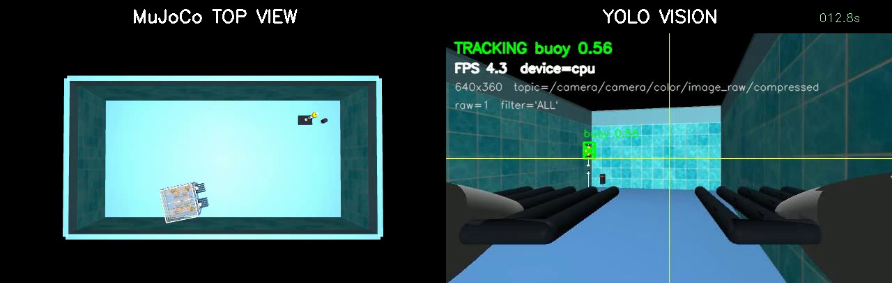
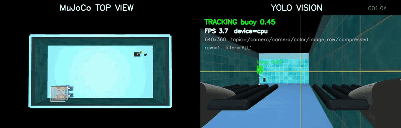

# KMU26 UUV MuJoCo + ArduSub Simulator

Ubuntu 22.04, ROS 2 Humble, MuJoCo and ArduSub SITL을 결합한 수중 로봇
시뮬레이션 작업공간이다. 활성 시뮬레이터는 `sim/current`이며, 웹/Tk
GUI, MAVROS 호환 제어면, 카메라·DVL·압력·하이드로폰·Ping360 센서, 부표 수집
물리를 한 스택에서 제공한다.

> 현재 폴더는 배포 산출물과 실험 로그가 함께 있던 개발 작업공간에서 정리한
> 소스 트리다. Git에는 소스와 문서만 올리고 ArduPilot, QGroundControl, 빌드
> 결과와 로그는 포함하지 않는다.

## Ubuntu 22.04 원클릭 설치

[⬇ KMU AUV Simulator 2026.08.02.1 설치판 다운로드](https://github.com/kanghyunmin-bot/ROS2-mujoco-UUVsimulator/releases/download/v2026.08.02.1/KMU_AUV_Simulator_Installer_2026.08.02.1.zip)

ZIP을 푼 뒤 `kmu-auv-simulator_2026.08.02.1_amd64.deb`를 더블클릭하고 Ubuntu
앱 센터에서 설치한다. 설치 후 앱 목록의 **KMU AUV Simulator**를 실행하면
ROS 2 Humble, MuJoCo, ArduSub SITL과 현재 대회 ROS 패키지를 자동 구성한다.
대상 환경은 Ubuntu 22.04 amd64이며 첫 설치에는 인터넷 연결과 약 15GB의 여유
공간이 필요하다. 체크섬과 개별 파일은
[v2026.08.02.1 릴리스 페이지](https://github.com/kanghyunmin-bot/ROS2-mujoco-UUVsimulator/releases/tag/v2026.08.02.1)에서 확인한다.

<p align="center">
  
</p>

왼쪽은 MuJoCo 수조 전체 시점, 오른쪽은 AUV 전방 카메라와 CPU 기반 YOLO 부표
추적 화면이다.

## 동작 화면

<p align="center">
  
</p>

실제 시뮬레이션에서 AUV가 이동하는 동안 카메라 영상, 부표 검출 결과와 top-view
상태가 함께 갱신되는 모습이다.

## 빠른 실행

이미 설치가 끝난 작업공간에서는 다음이 기본 실행 경로다.

```bash
source /opt/ros/humble/setup.bash
source ./sim/environment.sh
./run_control_gui.sh --web --host 127.0.0.1 --port 8878
```

브라우저에서 <http://127.0.0.1:8878/>을 열고 GUI에서 시뮬레이션 스택을
시작한다. Tk GUI는 `./run_control_gui.sh --tk`로 실행한다.

## Ubuntu 설치 배포판 만들기

현재 소스에서 이전 배포 템플릿 없이 Ubuntu 22.04 amd64용 DEB를 생성한다.

```bash
./packaging/build_release.sh
```

결과는 `documentary/release/builds/<VERSION>/`에 생성된다. 사용자에게는
`KMU_AUV_Simulator_Installer_<VERSION>.zip` 또는 그 안의 `.deb`를 전달한다.
DEB를 더블클릭해 설치한 뒤 앱 목록의 **KMU AUV Simulator**를 누르면 첫 실행
설치기가 ROS 2, MuJoCo, ArduPilot과 ROS 패키지를 자동 구성한다. 상세 검증 절차는
[배포 체크리스트](documentary/release/PORTABILITY_CHECKLIST.md)를 따른다.

## 새 Ubuntu 22.04에서 이어서 작업

현재 개발 스냅샷은 `agent/publish-clean-current-workspace` 브랜치에 있다.
YOLO 가중치는 Git LFS 객체이므로 일반 clone 전에 Git LFS를 설치한다.

```bash
sudo apt-get update
sudo apt-get install -y git git-lfs
git lfs install
git clone --branch agent/publish-clean-current-workspace \
  https://github.com/kanghyunmin-bot/ROS2-mujoco-UUVsimulator.git
cd ROS2-mujoco-UUVsimulator
git lfs pull
./sim/current/tools/install/install_uuv_sim_current_ubuntu22.sh \
  --noninteractive --skip-qgc
source ./sim/environment.sh
```

설치기는 소스 checkout을 자동으로 인식하고 ROS 패키지를 새로 빌드한다.
ArduPilot은 검증된 `2dd0bb7d4c85ac48437f139d66df648fc0e1d4ae`
커밋으로 맞춘 뒤 `sim/ardupilot_patches`의 현재 제어 패치를 적용한다.
진행 중인 하이드로폰→레인 비전 임무 상태는
[2026-07-31 인계 문서](documentary/VISION_LANE_HANDOFF_2026-07-31.md)에
정리되어 있다.

GUI 없이 SITL과 MuJoCo를 직접 실행하려면:

```bash
cd sim/current
./start_sitl_mujoco_mj311.sh -- --headless
```

ROS 2 브리지 없이 물리 런타임만 확인하려면 `--no-ros2`를 추가한다. 실제
MAVROS/차량 패키지와 동일한 통합면은 `--ros2-real-pkg-compat` 모드를 사용한다.

VirtualGL GPU 뷰어로 대회 미션을 목표 2배속으로 반복 검증하려면 별도 빠른
모드를 사용한다.

```bash
cd sim/current
./start_competition_fast_vgl.sh --no-reset --keep-eeprom --ros2 -- --ros2-images
```

이 모드는 MuJoCo timestep `0.005초`, 목표 RTF `2.0`, SITL speedup `2`를 함께
설정한다. `/clock`과 센서 stamp는 가공하지 않고 MuJoCo `data.time`을 그대로
사용한다. 먼 대회 부표의 유체력은 20 Hz(sim time)로 유지·갱신하지만 AUV
1.25 m 이내, 실제 접촉 중, 수집망 진입/포획/배출 중인 부표는 매 물리 스텝
계산한다. 최종 물리 합격 판정은 일반 실행 모드에서 다시 수행해야 한다.

## 시스템 구성

```text
Web/Tk GUI
    |
    +-- process manager ---- ArduSub SITL
    |                            |  JSON sensor/servo UDP
    |                            v
    +---------------------- MuJoCo runtime
                                 |
                                 +-- ROS 2 sensor/ground-truth bridge
                                 +-- camera / DVL / depth / hydrophone / Ping360
                                 +-- course buoy / cable / collector physics

Controller or operator
    -> /mavros/rc/override
    -> MAVROS or compatibility bridge
    -> ArduSub
    -> thruster PWM
    -> MuJoCo
```

기본 폐루프 런타임은 100 Hz 센서/추력 루프와 0.005초 MuJoCo timestep을
사용한다. 정면·상향 카메라는 검출 입력 계약을 일정하게 유지하기 위해 GUI와
런타임 모두 `1280x720 @ 10 Hz`로 고정되어 있으며 별도 화질/속도 프리셋은 없다.

상세한 프로세스, 포트, 토픽 소유권과 부표 수집 상태 머신은
[시뮬레이터 아키텍처](documentary/SIM_ARCHITECTURE.md)에 정리되어 있다.

## 주요 디렉터리

| 경로 | 역할 |
| --- | --- |
| `sim/current/` | 활성 MuJoCo 런타임, 브리지, GUI, 장면과 검증 도구 |
| `sim/current/sim/` | 물리, 런타임, 전송 계층과 계약 모듈 |
| `sim/current/bridge/` | ROS 2, MAVLink, 센서 및 영상 브리지 |
| `sim/current/scenes/` | 수조와 경기장 MuJoCo XML |
| `sim/current/tools/` | 정적·동적 계약 검사와 재현 도구 |
| `rospkg/src/` | 실제 차량과 공유하는 ROS 2 패키지 소스 |
| `analysis/` | 실험 데이터, 노트북, 비교 결과와 분석 도구 |
| `documentary/` | 아키텍처, 인터페이스 계약과 배포 문서 |
| `sim/ardupilot/` | 현재 런타임이 사용하는 ArduPilot 체크아웃 |
| `documentary/contracts/` | 실제 스택과 시뮬레이터의 인터페이스 계약 |

## 핵심 ROS 인터페이스

- 상태/제어: `/mavros/state`, `/mavros/rc/in`, `/mavros/rc/override`
- 항법: `/imu/data`, `/dvl/odometry`, `/depth/pose`, `/odometry/filtered`
- 카메라: `/camera/camera/color/image_raw/compressed`
- 음향: `/audio`, `/audio_info`, `/mujoco/hydrophone/direction`
- 소나: `/ping360/scan`, `/ping360/image`, `/ping360/config`
- 임무/평가: `/collector/state`, `/mujoco/course_buoys/status`,
  `/mujoco/ground_truth/pose`

Ground truth는 검증용 oracle이며 실제 차량용 제어기의 입력으로 사용하지 않는다.
RC를 내는 임무 노드는 동시에 실행하지 않고 mux의 단일 소유권 계약을 지켜야 한다.

## ROS 패키지 빌드

```bash
cd rospkg
./build_safe.sh --cmake-args -DBUILD_TESTING=OFF
source install/setup.bash
```

`build_safe.sh`는 메모리 부족을 피하기 위해 컴파일 병렬도를 제한한다.

## 빠른 검증

```bash
python3 sim/current/tools/check_gui_start_contract.py
python3 sim/current/tools/check_sim_runtime_smooth_contract.py
python3 sim/current/tools/check_competition_course_scene.py
python3 sim/current/tools/check_buoy_collector_capture.py
python3 sim/current/tools/check_dist_rc_override_path.py
```

실행 중인 외부 MAVROS 경로까지 검사하려면:

```bash
python3 sim/current/tools/check_external_fsm_mavros_contract.py
```

## Git에 게시하기 전에

대용량 YOLO 모델은 Git LFS 대상으로 지정되어 있다. 또한 `rospkg/src` 아래에는
여러 upstream 저장소의 `.git` 메타데이터와 로컬 수정이 남아 있으므로, 최초
저장소 생성 전에 monorepo 또는 submodule 방식을 결정해야 한다. 안전한 게시
순서와 현재 주의사항은 [Git 게시 가이드](documentary/GIT_PUBLISHING.md)를 따른다.

배포 ZIP/DEB 사용자를 위한 설치 안내는 [README_FIRST.md](documentary/release/README_FIRST.md),
실제 차량 ROS 패키지 설명은 [rospkg/README.md](rospkg/README.md)를 참고한다.
