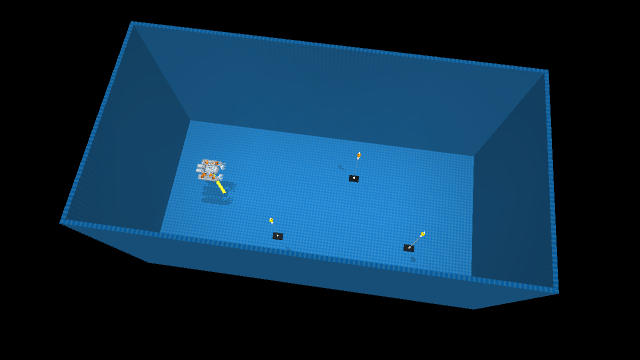
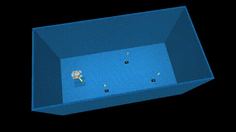
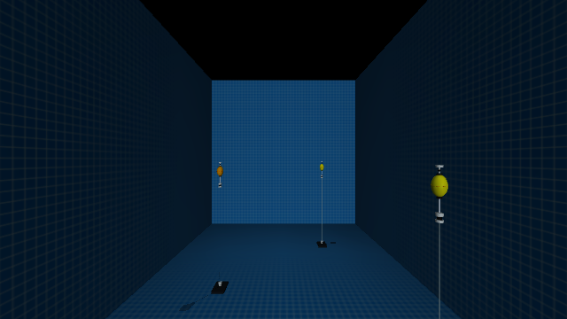
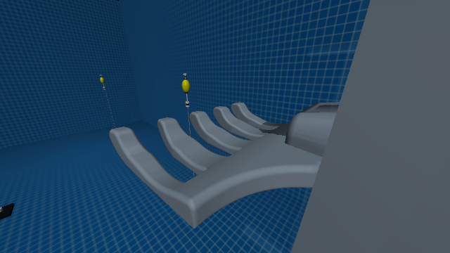

# KMU26 Underwater ROV Simulator

**MuJoCo · ArduSub SITL · ROS 2 Humble · VLA data collection**

10 × 5 × 5 m 연구용 수영장, 전방·손 카메라, DVL·IMU·수심 센서와 부표·자석·줄 접촉을 통합한 ROV 연구 환경입니다. 웹 GUI에서 조종하고 시연을 기록해 LeRobot/U0 학습 입력으로 내보낼 수 있습니다.

**최신 소스: `main` · 2026.09.12** · [변경 사항](docs/versions/2026.09.12.md) · [설치 안내](README_FIRST.md)



## 최신 장면과 영상



[MP4 장면 미리보기](docs/assets/research-pool-20260912.mp4). 실제 MuJoCo 렌더러로 촬영한 카메라 회전 영상입니다. 정책 실행이나 실물 전이 성공 영상이 아닙니다.

| 전방 카메라 | 손 카메라 |
|---|---|
|  |  |

## 구현 및 검증 범위

- **환경:** 연구 수영장과 테스트 수조, 실물 bag을 참고한 파란 라이너 재질, 편집 가능한 부표·ROV 위치.
- **물리:** 분산 부력·항력·물살, 15 N 자석 분리, 충돌을 유지한 6관절 줄. 접힌 줄의 발산 재현 시험과 안정화 수정 포함.
- **제어:** ArduSub SITL → PWM → 추진기, MAVROS RC override, 웹 스틱·브라우저 게임패드 지원.
- **VLA:** 상태 23차원, 행동 4차원 `[surge, sway, heave, yaw]`, 전방·손 카메라, 출처·종료 이유·시각 기록. 정책의 RC 단일 발행자 검사.
- **파이프라인:** 시뮬레이션 시간 10 Hz 정지 수집 50행 → LeRobot → 실제 U0 전처리와 완전한 16행동 청크 35개 전달 확인.
- **실물 로그 활용:** 단일 수조 주행 bag으로 제한적인 수평 응답 보정. 별도 opt-in 프로파일이며 기본 모델의 실측 인증이 아닙니다.

**학습된 우리 ROV용 VLA 체크포인트·작업 성공·실물 전이는 검증하지 않았습니다.** 정지 연결 데이터를 유효한 작업 시연으로 사용하지 않습니다. CAD 장착값·유체 계수·센서 광학은 추가 실측이 필요합니다.

## 설치와 실행

지원 기준은 **Linux x86_64, Ubuntu 22.04 / ROS 2 Humble**입니다. Ubuntu 24.04 호스트에서는 22.04 개발 컨테이너를 권장합니다. Windows/macOS 네이티브, ARM, GPU 종류 전체에 대한 호환성은 보장하지 않습니다.

```bash
git lfs install
git clone --recurse-submodules https://github.com/kanghyunmin-bot/ROS2-mujoco-UUVsimulator.git
cd ROS2-mujoco-UUVsimulator
git checkout main
git submodule update --init --recursive
git lfs pull
```

ROS 2 Humble이 설치된 Ubuntu 22.04에서는:

```bash
source /opt/ros/humble/setup.bash
./setup/install_uuv_mujoco.sh --with-ros2 --noninteractive
source ./.uuv_mujoco_env.sh
./run_control_gui.sh --web --sim-preset research_pool_distributed --host 127.0.0.1 --port 8878
```

<http://127.0.0.1:8878/>에서 **Start SITL/MuJoCo → READY 확인 → Arm** 순서로 시작합니다. 웹 GUI의 기본 카메라 4 Hz 프로파일은 모니터링용이며, 10 Hz VLA 수집에서는 원본 프레임의 유효 비율을 확인해 더 높은 발행률을 선택해야 합니다.

Docker 설치·GPU 설정은 [개발 컨테이너 안내](docker/ubuntu-dev/README.md)를 참고하세요. 활성 코드는 `uuv_mujoco/current`입니다. `.uuv_mujoco_env.sh`와 시스템 장치 권한은 각 PC에서 설정해야 합니다. GitHub 자동 소스 ZIP에는 submodule 및 Git LFS 실파일이 완전하게 포함되지 않을 수 있으므로 위 clone 절차를 사용하세요.

## 데이터 수집과 검증

| 목적 | 문서 |
|---|---|
| 수집기 설정·실행 | [VLA collector](rospkg/src/auv_vla_data_collector/README.md) |
| 정책 어댑터 | [VLA policy](rospkg/src/kmu26_auv_vla_policy/README.md) |
| 실물/시뮬 계약 | [Real stack parity](docs/contracts/REAL_STACK_PARITY.md) |
| 최신 파이프라인 검사 | [Offline hardening](docs/contracts/OFFLINE_HARDENING_20260912.md) |
| 실물 로그 보정의 범위 | [Horizontal response](docs/contracts/HORIZONTAL_RESPONSE_CALIBRATION_20260912.md) |
| 줄 안정화와 재현 절차 | [Rope stability](docs/gui/ROPE_STABILITY_20260912.md) |
| 센서 장착 가정 | [CAD sensor mounts](docs/gui/CAD_SENSOR_MOUNTS.md) |

`/mujoco/ground_truth/pose` 등 시뮬레이션 정답 토픽은 진단용이며 VLA 실물 입력으로 사용하지 않습니다. RC 명령은 추력이나 결과 움직임과 다른 값입니다. 녹화 세션 단위로 학습·검증 데이터를 분리하세요.

```bash
# MuJoCo·NumPy가 설치된 Python 환경에서, ROS 없이 수행 가능
python uuv_mujoco/current/tools/check_research_pool_scene.py
python uuv_mujoco/current/tools/check_research_pool_magnet_rope.py
python uuv_mujoco/current/tools/check_rope_fluid_ownership.py
python -m pytest -q uuv_mujoco/current/tools/test_hydrodynamic_batch_sampling.py
```

실물 bag, 개인 실험 산출물, 학습 가중치는 이번 소스 갱신에 포함하지 않습니다. 문서의 `outputs/` 경로는 로컬 검사 기록을 가리키며, 공개 배포의 검증 요약은 [버전 기록](docs/versions/2026.09.12.md)에 제공합니다. 이전 YOLO 시연은 `docs/assets/simulator-demo.gif`에 보존합니다.
