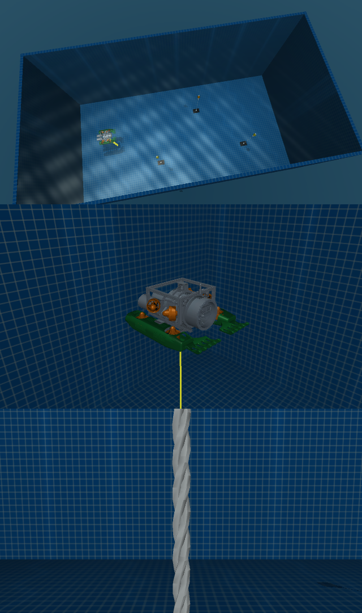

# Pool water, white ropes and green robot — 2026-09-14

The research pool now has a visual-only animated water surface, bounded highlights,
depth-dependent incoming light loss and approximate moving caustics. Only the two hands and the two lower capsule assemblies are green.
Enclosure and external frame colors are restored to their original values. The three buoy moorings use shared three-strand white
visual sleeves over their original invisible collision capsules. The visual outer
radius is approximately 3.5 mm; the physical capsule radius remains 3 mm.

The selective color mesh contains exactly 58,158 existing triangles from CAD
components 92, 93, 137, 138, 181 and 182. Four lower shell components form the
two capsules. These triangles were removed from the original chunks and reused
without decimation or added geometry; `selective_colors.json` records the mapping.

## Rendering and cost boundaries

- `pool_lite` enables `underwater_optics.pool_lighting_enabled`. Other profiles
  default to false. Recorded front/hand ROS images use the same lighting path.
- Three world-coordinate waves use simulation time, with total displacement
  bounded by 16 mm. The native viewer uses an 81 × 41 visual height field.
- Native height-field uploads run with at most one outstanding background request.
  Busy refreshes are skipped. They must not block physics, control or capture.
  Native display refreshes can therefore lag; recorded camera effects always use
  the capture simulation timestamp.
- Camera highlights intersect a bounded water plane and respect foreground depth.
  Wave slopes and caustic fields use half-resolution calculations; original RGB,
  depth and foreground masks keep full resolution. The apparent moving wave
  normals do not refract rays or alter the camera depth map.
- Incoming direct light decays exponentially with depth; an ambient floor remains.
  Camera-to-object attenuation/backscatter still runs separately afterward.
- These are qualitative optical approximations, not calibrated water optics.
  There are no reflected surroundings/objects, refracted rays, volumetric light
  shafts, light-source occlusion or fluid-particle simulation. Native viewer
  shading and camera postprocessing are different render paths, not pixel-identical.

## Verification

- MuJoCo 3.8.0 and 3.12.0: 54 tests and 14 subtests passed for camera optics,
  capture timing, pool layout, deterministic lighting and foreground masking.
- The native-upload regression test failed with synchronous uploads (1 second
  blocked fake upload), then passed with the bounded background implementation.
- 812 original physical geoms retained exact sizes, transforms, friction, contact
  parameters and fluid coefficients. Body masses/inertias, joints and equality
  constraints matched the previous committed model exactly. Rope fluid ownership
  check passed. No required dependency was added.
- Static EGL benchmark, 640 × 360, 30 frames after 5 warmups: full capture plus
  optics median 4.26/4.54 ms without new lighting, 11.52/11.51 ms with it (front/hand).
  Enabled p95 12.68/13.04 ms. Same changed scene, host MuJoCo 3.8; live simulation
  was also running, so this is a local cost sample, not an isolated GPU benchmark.
- Independent 15-second live probe on MuJoCo 3.12: both cameras produced 15 Hz in
  simulation time (3.87 Hz in wall time), 38/38 fresh valid sampled frames, no
  duplicate/rewound sample stamps, maximum age 60 ms in simulation time.
  Whole-simulation RTF was 0.257. This is not a controlled overall speedup claim.
  Raw IMU was 50 Hz in simulation time. Vehicle remained disarmed in MANUAL.
- Full VLA episode export/training was not rerun for this visual change.

## Inspect or reproduce



Machine-readable evidence: `docs/assets/pool-water-validation-20260914.json`.
Preview animation: `outputs/water-visual-validation/surface.mp4` (local artifact).

```bash
MUJOCO_GL=egl python uuv_mujoco/current/tools/render_water_visuals.py --output_dir outputs/water-visual-validation
MUJOCO_GL=egl python uuv_mujoco/current/tools/render_camera_validation.py --output_dir outputs/water-visual-validation/enabled
MUJOCO_GL=egl python uuv_mujoco/current/tools/render_camera_validation.py --water_lighting off --output_dir outputs/water-visual-validation/baseline
```

The scripts render an independent model and do not publish vehicle controls.
The native viewer enables geom group 5 for the new pool surface at startup.


## Desktop camera recovery

On the local XWayland desktop, mixing an inherited `MUJOCO_GL=egl` camera
renderer with the native GLFW viewer reproduced `Failed to make the EGL context
current`. A hidden native-context + camera probe failed with EGL and passed
with GLFW. Graphical Linux launches now select GLFW consistently and remove a
conflicting EGL PyOpenGL override; headless Linux retains EGL. Four executable
launcher-selection tests passed; the native-viewer regression failed against
the previous launcher. Front/hand JPEGs were then verified in the actual web GUI.

The native viewer's digit 2 is also a geometry-group visibility shortcut and can
hide robot visuals in group 2. This is separate from camera production failure.
MuJoCo source: https://github.com/google-deepmind/mujoco/blob/3.12.0/simulate/simulate.cc
