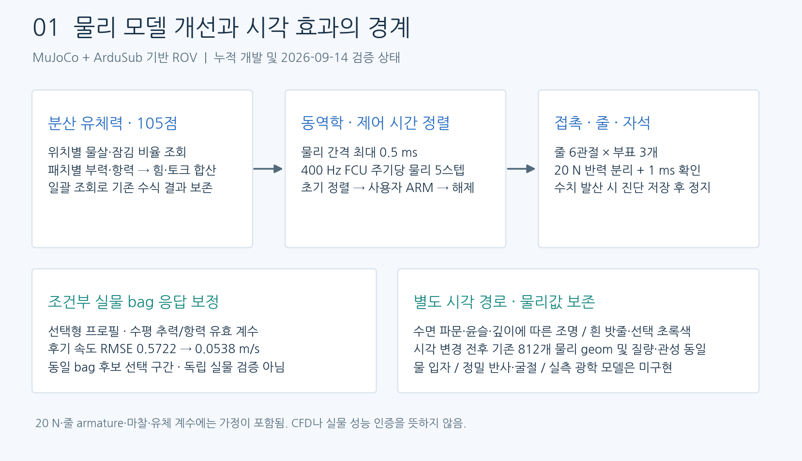
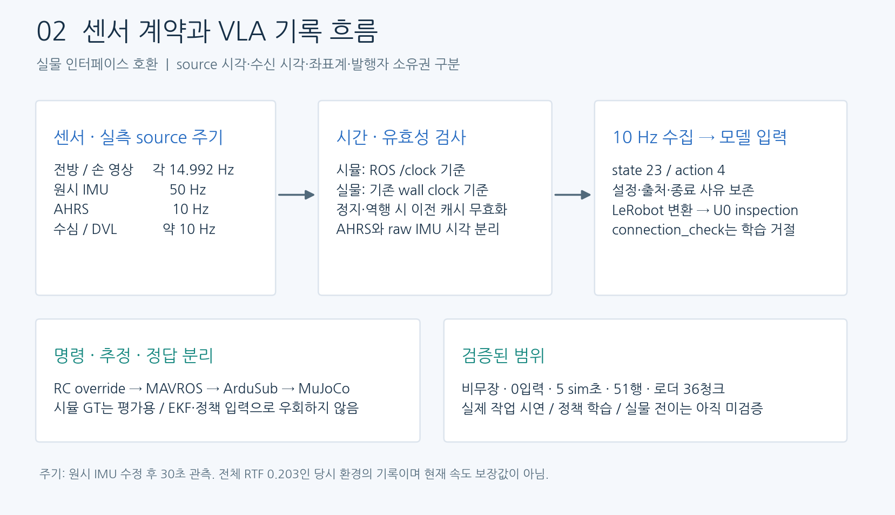
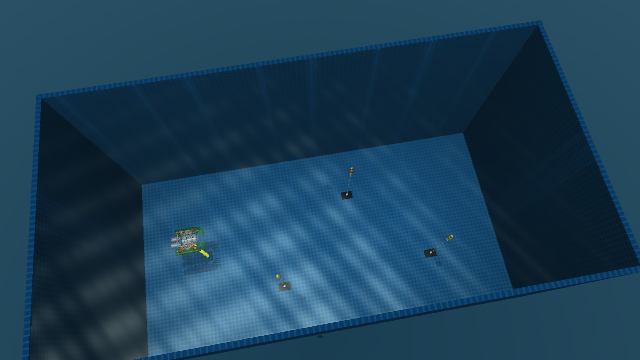
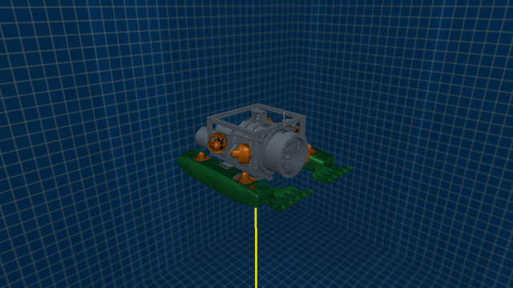
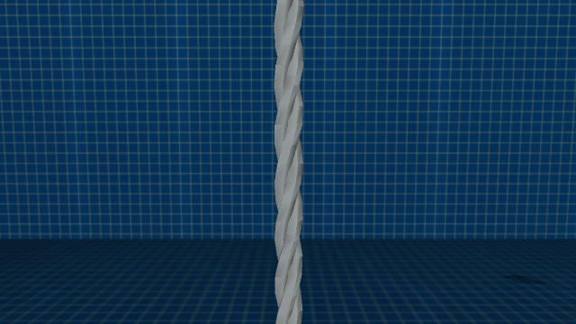
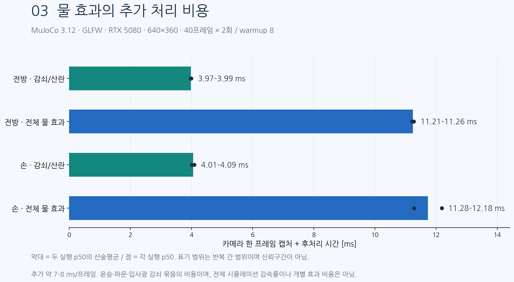

# UUV 시뮬레이터 업데이트 — 물리·센서 계약·경량 렌더링
2026-09-14 · 누적 개발 요약과 최신 카메라 복구까지 반영. 실제 대상은 ROS2-mujoco-UUVsimulator의 MuJoCo 런타임이며 IsaacLab 본체를 수정한 작업이 아니다.

**현재 판단: 소규모 작업 시연의 시험 수집으로 진행할 수 있다. 실제 작업 VLA 학습·자율 수행·Sim2Real 성공은 아직 검증하지 않았다.** 아래의 구현, 로컬 검증, 실물 보정 가정은 서로 구분한다.

## 1. 물리 모델 개발과 안정화

### 분산 유체력과 계산 최적화
- 연구 수영장 분산 프로필은 선체에 고정된 105개 지점에서 물살·잠김 비율을 조회하고, 지점별 부력·형상 항력·표면 항력을 힘과 토크로 합산한다.
- 물살과 수면 조회를 반복 스칼라 호출에서 일괄 계산으로 변경했다. 기존 수식의 힘·토크·잠김 비율 등 모든 결과를 여러 자세·속도·수면 조건에서 비교하는 회귀 검사를 추가했다.
- 차량의 사용자 정의 유체력과 MuJoCo 기본 유체력이 중복 적용되지 않도록 소유권을 분리했다. 줄에는 작은 기본 점성 저항과 관절 감쇠를 유지한다.
- 이것은 MuJoCo 위에 구현한 ROV 수중 동역학 모델이다. 유체 격자를 푸는 CFD나 Stonefish 엔진을 통합한 결과는 아니다.

### 접촉·부표·줄
| 항목 | 현재 구현 | 검증 범위 |
|---|---|---|
| 물리 시간 | 최대 0.5 ms, implicit 적분, 400 Hz FCU당 5스텝 | GUI의 큰 시간 간격 요청이 장면 제한을 덮지 않음 |
| 갈퀴–PVC 접촉 | 갈퀴 solref 0.001 1 | MuJoCo 3.12 경사 충돌 64조건에서 최대 침투 3.313 → 2.040 mm |
| 자석 | 병진 반력 20 N, 1 ms 지속 확인 후 분리 | 18.980 N 유지, 25 N 추가 하중에서 분리 확인 |
| 줄 | 부표당 6개 ball joint, 총 18개 링크 | 접촉·처짐·부표 상승 및 부착 줄 충돌 검사 |
| 수치 안정화 | 관절 armature 2e-5 kg·m² | 실측 관성이 아니라 안정화 가정 |
| 실패 처리 | 직전 상태·가속도·관절 정보를 저장하고 런타임 정지 | 발산을 숨기고 자동 리셋하면서 수집하지 않음 |

20 N은 사용자 지정 분리 기준이며 실물 자석의 전단·박리 모델이나 힘의 상한이 아니다. 6링크 줄은 거친 굽힘·장력을 근사하며 매듭·촘촘한 감김·탄성 파단을 재현하지 않는다. 접촉 침투가 0이 되거나 모든 조종 조건에서 안정하다는 결과도 아니다.

초기에는 자세를 유지한 채 센서와 시뮬레이션 시간을 계속 진행한다. 최신 EKF 자세 정렬과 사용자의 실제 ARM이 확인되어야 초기 고정을 해제한다. 정렬만 완료되었다고 자동으로 무장하지 않는다.

### 실물 rosbag 기반 조건부 응답 보정
단일 bag 재생에서는 벽 영향을 제외한 진단 수조에서 수평 추력·전후 항력의 유효 계수를 추정했다. 기본 GUI 물리 프로필을 덮어쓰지 않고 선택형 프로필로 보존했다.

| 동일 진단 조건 | 후기 전후 속도 RMSE | XY RMSE |
|---|---:|---:|
| 실물 설정 + 기존 물리 | 0.5722 m/s | 5.328 m |
| 저장한 최종 유효 프로필 | 0.0538 m/s | 0.573 m |

후기 속도 오차가 약 90.6% 감소했지만, 해당 구간도 후보 선택에 사용한 동일 bag의 검증 구간이다. 독립 실물 시험이 아니다. XY 비교 대상은 실물 FCU 추정 위치이며 외부 위치 정답이 아니다. 질량·부가질량·장착·지연의 오차를 흡수한 계수이므로 실물 추진기 성능이나 항력의 절대 계측값으로 해석하지 않는다.

근거: [분산 일괄 계산 검사](https://github.com/kanghyunmin-bot/ROS2-mujoco-UUVsimulator/blob/9ad5a22/uuv_mujoco/current/tools/test_hydrodynamic_batch_sampling.py), [접촉 검사](https://github.com/kanghyunmin-bot/ROS2-mujoco-UUVsimulator/blob/9ad5a22/docs/gui/RAKE_CONTACT_20260912.md), [줄·자석 계약](https://github.com/kanghyunmin-bot/ROS2-mujoco-UUVsimulator/blob/9ad5a22/docs/gui/BUOY_MAGNET_AND_ROPE.md), [조건부 보정](https://github.com/kanghyunmin-bot/ROS2-mujoco-UUVsimulator/blob/9ad5a22/docs/contracts/HORIZONTAL_RESPONSE_CALIBRATION_20260912.md).

## 2. 센서·제어·수집 계약 정렬

### 소유권과 좌표계
- 명령은 RC override → 실제 MAVROS → ArduSub → MuJoCo 경로로 전달한다. ground truth 토픽은 평가용이며 추정기나 정책에 정답을 우회 공급하는 경로로 쓰지 않는다.
- AHRS 자세와 원시 IMU 각속도·가속도를 분리했다. 시뮬 원시 IMU는 body FLU로 변환된 값을 사용하고, 자세 시각으로 원시 가속도 캐시의 freshness를 대신 갱신하지 않는다.
- 엄격한 실물 호환 모드에서 AHRS는 외부 MAVROS, 원시 IMU·압력은 도착 패킷을 반영하는 시뮬 브리지가 소유한다. 실물에서는 기존 MAVROS 소유권을 유지한다.
- DVL 장치 모드에서는 A50 TCP 에뮬레이터에 실제 드라이버를 연결하고 중복 ROS 발행을 억제한다.
- 두 카메라는 전방과 우측 갈퀴 손 시점이다. 기존 stereo_left/right 명칭은 호환성을 위해 유지하지만, 평행한 스테레오 좌우쌍이라고 가정하면 안 된다.

### 시각·주기·세션 무결성
- 시뮬레이션에서는 ROS 시간을, 실물에서는 기존 벽시계 기준을 사용한다. 시뮬 시계 미수신·정지·역행을 준비 표시, 수집 시작, 샘플 기록, 정책 입력에서 일관되게 거절한다.
- 정지·역행 후 센서뿐 아니라 이전 FCU 무장·모드 상태도 무효화한다. 제어 deadman과 시계 정지 watchdog은 벽시계 기준을 유지한다.
- 이중 촬영 주기 제한으로 15 Hz 요청이 10 Hz로 줄던 결함을 수정했다. 촬영 시각과 도착 시각을 구분하며 밀린 프레임을 최신 시각으로 다시 찍지 않는다.
- MAVProxy 반복 ALL-stream 요청을 기본적으로 끄고 명시적 센서 주파수가 덮이지 않도록 했다.
- 세션 준비부터 종료까지 센서·물리 설정을 잠그고 출처를 저장한다. 종료된 레코더 요청이나 이전 응답이 새 세션에 섞이지 않도록 정리했다.
- state 23 / action 4 계약은 유지했다. 잘못된 시각·NaN·다른 IMU 계약의 조용한 병합을 검사하고 원시 IMU 시각을 행별 감사 기록과 내보내기에 보존한다.

### 실제 관측 결과
원시 IMU 수정 후 DDS 발견 대기 8초와 벽시계 30초 관측에서, 10 Hz 수집 시점 60개를 검사한 기록이다. 아래 Hz와 age는 시뮬레이션 시간 기준이며 브라우저 FPS가 아니다.

| 입력 | 실측 source Hz | 검사 시 유효율 | 최대 age |
|---|---:|---:|---:|
| 전방·손 영상 | 각각 14.992 | 100% | 0.060 s |
| AHRS | 10.0 | 100% | 0.010 s |
| 원시 IMU motion | 50.0 | 100% | 0.020 s |
| 수심 | 10.0 | 100% | 0.100 s |
| DVL | 약 10.004 | 100% | 0.095 s |

당시 전체 RTF는 0.203이었다. 이후 디스플레이·렌더 백엔드가 변경되었으므로 현재 성능이나 개선율로 재사용하지 않는다. 짧은 비무장 검사이며 장시간 작업 중 무결성까지 보장하지 않는다.

근거: [실물 스택 계약](https://github.com/kanghyunmin-bot/ROS2-mujoco-UUVsimulator/blob/9ad5a22/docs/contracts/REAL_STACK_PARITY.md), [수집기 검증](https://github.com/kanghyunmin-bot/ROS2-mujoco-UUVsimulator/blob/9ad5a22/docs/contracts/PRE_VLA_COLLECTOR_READINESS_20260914.md), [실측 JSON](https://github.com/kanghyunmin-bot/ROS2-mujoco-UUVsimulator/blob/9ad5a22/docs/assets/pre-vla-live-motion-20260914.json).

## 3. 수면·수중 조명·로봇과 밧줄 시각화
아래 세 이미지는 2026-09-14 최신 소스로 독립 MuJoCo 장면을 다시 렌더한 정적 프리뷰다. 실행 중 차량을 조종하거나 녹화하지 않았고, 생성형 AI 이미지나 학습 시연이 아니다.

### 수면 파문·윤슬과 깊이에 따른 빛 감소

- 세 개의 월드 좌표 파동을 시뮬레이션 시간으로 갱신한다. 시각 변위 합은 최대 16 mm, native viewer는 81×41 높이장을 사용한다.
- 카메라 영상에는 수면 법선에 따른 하이라이트, 움직이는 근사 집광 무늬, 깊이에 따른 입사광 지수 감쇠를 적용한다. 주변광 바닥값은 유지한다.
- 카메라에서 물체까지의 수중 경로에 따른 색 감쇠·후방 산란은 별도로 적용한다. RGB와 같은 장면의 깊이를 사용하고 수면 아래 구간을 계산한다.
- 정밀 주변 반사·이동 물체 반사·굴절 광선·체적 광선·빛 차폐·유체 입자 시뮬레이션은 구현하지 않았다. 실측 계수로 보정된 광학도 아니다.
- native viewer와 저장 카메라는 다른 표현 경로이므로 픽셀 단위로 동일하지 않다. 시각 파문이 물리 부력이나 카메라 깊이를 바꾸는 것은 아니다.

### 로봇 색상 범위

손 두 개와 하부 캡슐 두 조립체에만 초록색을 적용했다. 인클로저와 외부 프로파일은 원래 색상을 유지한다. 기존 CAD의 58,158개 삼각형을 선택 분리해 재사용했고, 중복 추가나 메시 단순화는 하지 않았다.

### 흰색 밧줄 형상

3가닥 꼬임의 흰색 시각 메시를 기존 줄 충돌 캡슐에 씌웠다. 시각 반지름은 약 3.5 mm, 기존 물리 반지름은 3 mm다. 공유 메시로 형상을 재사용하며 실제 꼬임의 접촉·탄성을 추가 계산하지 않는다.

시각 변경 전후 기존 812개 물리 geom의 크기·위치·접촉·유체 계수와 body 질량·관성·관절·equality가 같음을 검사했다. 이는 이번 시각 수정의 물리 보존 결과이며, 앞선 접촉 안정화가 동역학을 바꾸지 않았다는 뜻은 아니다.

근거: [물·밧줄·선택 색상 보고서](https://github.com/kanghyunmin-bot/ROS2-mujoco-UUVsimulator/blob/9ad5a22/docs/POOL_WATER_VISUALS_20260914.md).

## 4. 경량화와 물 효과 성능 비용

RTX 5080, MuJoCo 3.12 / GLFW, 640×360, shadow 1024, MSAA 설정 1. 모드마다 warmup 8회 후 정적 장면 40프레임씩 두 번 측정했다. 실행 중 시뮬레이터와 같은 장비에서 독립 모델을 사용한 처리 비용 표본이다.

| 카메라 | 깊이·감쇠·산란 포함 p50 | 전체 물 효과 포함 p50 |
|---|---:|---:|
| 전방 | 3.97–3.99 ms | 11.21–11.26 ms |
| 손 | 4.01–4.09 ms | 11.28–12.18 ms |

범위는 두 실행의 중앙값 범위이며 신뢰구간이 아니다. 새 조명 효과 묶음의 추가 비용은 약 7–8 ms/프레임이다. 카메라 처리만 약 2.8배 수준으로 늘었으며, 전체 시뮬레이션이 2.8배 느려졌다는 뜻은 아니다. 개별 윤슬·산란 효과별 독립 비용도 아직 분리 측정하지 않았다. 두 카메라를 15 simHz로 직렬 처리하면 약 0.22 벽시계초/sim초의 추가 처리량에 해당하는 산술 추정이다.

- 파동 법선과 집광 무늬는 절반 해상도로 계산하고 RGB·깊이·가림 마스크는 원본 해상도를 유지한다.
- native 높이장 업로드는 동시 미완료 요청을 최대 1개로 제한한다. 바쁘면 시각 갱신을 건너뛰고 물리·제어·촬영을 기다리게 하지 않는다.
- 브라우저 미리보기는 0/2/4/10 fps로 제한하고 최신 프레임만 요청한다. 숨겨진 탭과 중복 요청을 억제하며, ROS 원본 촬영·기록 주기는 별도로 유지한다.
- 정밀 반사·굴절과 추가 유체 시뮬레이션을 넣지 않아 비용을 제한했다. 실시간 RTF 1.0 달성이나 모든 환경에서 일정한 처리 시간을 보장하지 않는다.

원자료: [GLFW 반복 측정 요약](assets/uuv-update-20260914/water-cost-summary.json), [실행별 설정·해시·측정값](assets/uuv-update-20260914/benchmark). 그림의 막대는 두 실행 p50의 산술평균이며 점은 각 실행 p50이다.

## 5. GUI 카메라 복구와 표시 문제 구분
- 데스크톱 native viewer와 EGL 카메라 컨텍스트를 혼용했을 때 카메라 생성이 실패하는 문제를 재현했다.
- Linux 그래픽 실행에서는 GLFW를 선택하고 충돌하는 EGL PyOpenGL 설정을 정리한다. headless Linux에서는 EGL을 유지한다.
- native 컨텍스트와 카메라를 함께 만드는 재현에서 EGL은 실패, GLFW는 성공했다. 실제 웹 대시보드에서 전방·손 JPEG가 계속 갱신되는 것도 확인했다.
- 숫자 2는 MuJoCo의 geometry group 2 표시 토글과 겹친다. 창은 남고 로봇 형상만 사라지는 현상은 이 표시 단축키 때문일 수 있다. 이번 수정에서 숫자 키 충돌 자체를 재매핑한 것은 아니다.

수정 커밋: [9ad5a22 · 데스크톱 viewer / camera 백엔드 정렬](https://github.com/kanghyunmin-bot/ROS2-mujoco-UUVsimulator/commit/9ad5a22). 해당 코드의 [GitHub Source checks](https://github.com/kanghyunmin-bot/ROS2-mujoco-UUVsimulator/actions/runs/34824771376)는 MuJoCo 3.8 / 3.12에서 통과했다.

## 6. 수집기 준비 상태와 다음 단계
| 단계 | 상태 | 실제 근거 |
|---|---|---|
| 센서→수집→내보내기→모델 입력 | 확인 | 비무장·0입력·5 sim초·51행, LeRobot 변환 및 U0 inspection 36청크 |
| 실제 작업 시연 품질 | 미검증 | 연결 자료는 connection_check / success=false |
| 정책 최적화·GPU 정책 추론 | 미실행 | 로더 검증만 수행 |
| 학습 정책의 시뮬 자율 성공률 | 미검증 | 별도 시연과 평가 에피소드 필요 |
| 실물 전이 | 미검증 | 카메라·동역학 보정 및 제한된 실물 시험 필요 |

최신 GLFW 카메라 복구 이후에는 실제 작업 에피소드로 수집·내보내기를 다시 확인해야 한다. 현재 목표는 단일 작업의 작은 시험 수집이다. 초기 제안은 10–20개 정도의 깨끗한 시연 → 시간 정렬·성공 라벨 검토 → 작은 기준 모델 학습 → 학습에 쓰지 않은 시작 위치·환경에서 자율 수행 평가다. 이 수량은 충분한 학습량으로 검증된 기준이 아니다.

실물에서는 수중 카메라 내·외부 파라미터, 노출·탁도, 질량·순부력·추진기 응답·항력·명령 지연을 측정해야 한다. 시각 품질만 높인다고 Sim2Real이 완성되지는 않는다. DLSS나 디퓨전은 현재 구현에 포함하지 않았으며, 디퓨전 증강은 기하·접촉·시간 일관성을 지킨 상태에서 실제 평가 개선 여부를 확인한 뒤 검토한다.

## 7. Git 이력·재현 자료
- [b7c49ec](https://github.com/kanghyunmin-bot/ROS2-mujoco-UUVsimulator/commit/b7c49ec): 변경 전 스냅샷, 접촉·초기 정렬 등 누적 로컬 변경 보존.
- [bec308a](https://github.com/kanghyunmin-bot/ROS2-mujoco-UUVsimulator/commit/bec308a): 수집 시계·센서 계약·경량 카메라 점검.
- [7003163](https://github.com/kanghyunmin-bot/ROS2-mujoco-UUVsimulator/commit/7003163): 수면·조명·흰 밧줄 시각화.
- [94d4879](https://github.com/kanghyunmin-bot/ROS2-mujoco-UUVsimulator/commit/94d4879): 손·하부 캡슐만 선택 초록색.
- [9ad5a22](https://github.com/kanghyunmin-bot/ROS2-mujoco-UUVsimulator/commit/9ad5a22): GUI 카메라 GLFW 복구.
- 이 정리 문서와 PNG, 원자료 요약 및 그림 생성 소스도 Git에 함께 보존한다. 실행 중 갱신되는 MUJOCO_LOG.TXT와 과거 실행 상태의 RUNTIME_VERSION.json은 배포 소스 변경으로 포함하지 않는다.

그림 생성 소스: [20260914_update_figures.py](report_sources/20260914_update_figures.py). matplotlib과 한국어 글꼴이 있는 문서 생성 환경에서 재생성할 수 있으며, 시뮬레이터 필수 의존성은 추가하지 않았다. 실제 렌더는 기존 `render_water_visuals.py`로 독립 생성했다.

노션: [UUV_sim의 real2sim for VLA 토글 아래 07번 정리](https://www.notion.so/3dbad8acb9a1813baae9dee2b6eec7d2). 물리·센서·시각화·성능·GUI·수집·Git을 각각 접을 수 있는 제목으로 구성했다.

문서 게시 전 로컬 재검증: 관련 pytest **79 passed, 1 skipped, 14 subtests passed**. 표시 환경을 요구하는 native context 검사는 이 호스트 실행에서 skip이며 기존 GUI 실기 검증과 구분한다. Node 미리보기/센서 표시 2개, 수영장 장면, 줄 유체 소유권, Ruff 오류 검사 및 새 그림 소스 포맷 검사가 통과했다. 기존 Python 캐시를 사용하는 첫 검사에서는 초기 pose 유지 1개가 실패했으나, 소스를 바꾸지 않고 별도 새 `PYTHONPYCACHEPREFIX`로 재검사하자 전체 검사가 통과했다. 저장소 소스와 오래된 bytecode를 혼용하지 않도록 재현 시 캐시를 분리한다.
