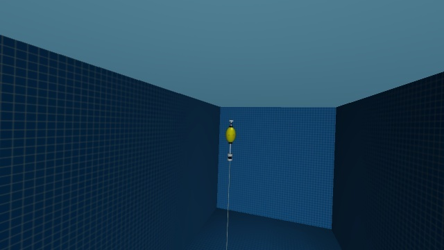
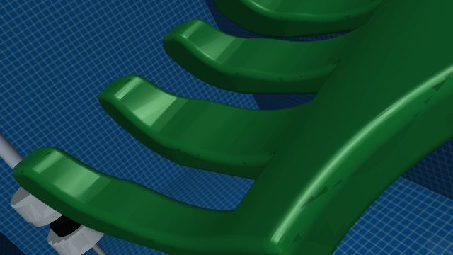
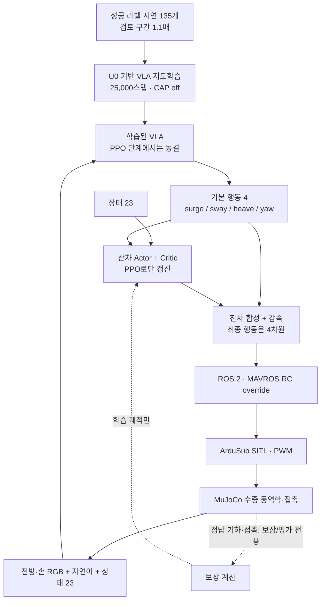
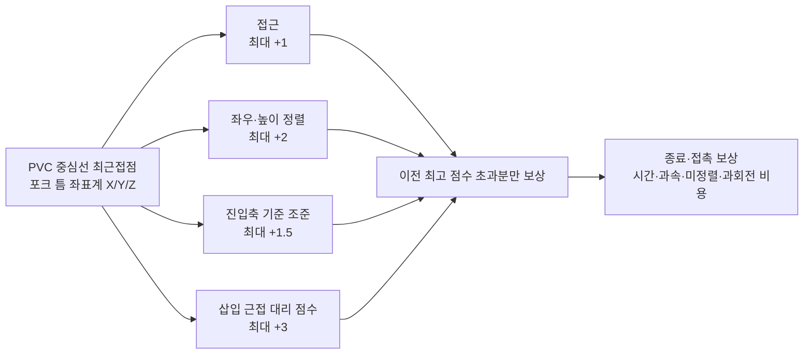
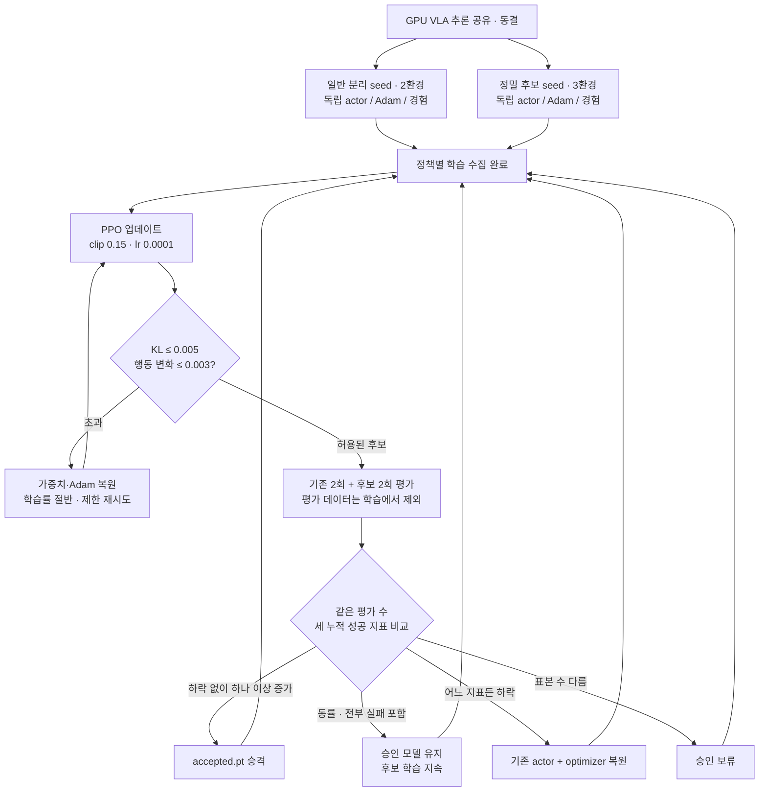
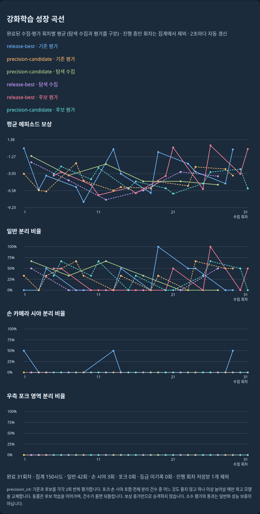

# 2026-09-22 · 수집 준비에서 VLA + 잔차 PPO까지

**요약:** 9월 14일의 수집·U0 입력 연결 확인에서, 성공 시연 학습 → 실제 정책 추론 → 병렬 잔차 PPO → 독립 평가·체크포인트 승인까지 확장했다. 현재 연구 구현의 기록이며 정밀 삽입, CAP 대체 효과 또는 실로봇 전이 성공을 선언하는 릴리스가 아니다.

기준: [9월 14일 보고서](UUV_UPDATE_20260914.md) · [노션 기준 페이지](https://app.notion.com/p/3dbad8acb9a1813baae9dee2b6eec7d2).

## 1. 실제 실행 영상과 카메라

| 전방 카메라 · 접근 | 손 카메라 · 근접 |
|---|---|
|  |  |

[실제 두 카메라 정책 실행 영상 · MP4](assets/uuv-update-20260922/dual-camera-rollout.mp4)

2026-09-22 실행의 저장된 원본 49쌍을 좌측 전방·우측 손 시점으로 합쳤다. 명목 수집 주기 10Hz로 재생하며 벽시계 실시간 속도를 나타내지 않는다. 두 정지 이미지는 서로 다른 프레임이다. 이 에피소드는 **손 시야 분리(`hand_view`)이며 정밀 포크 분리(`right_fork`)가 아니다.** 시각적으로 설명하기 좋은 예시를 선택했으므로 성공률의 근거로 사용하지 않는다. 생성 이미지는 사용하지 않았다. [출처·제작 조건](assets/uuv-update-20260922/README.md)

## 2. 기록 대비 구현 변화

| 영역 | 9월 14일 기록 | 9월 22일 구현 |
|---|---|---|
| 데이터 | 정지 연결 검사, 실제 작업 품질 미검증 | 성공 라벨 시연 135개, 14,522프레임; 검토한 979프레임만 1.1배 강조 |
| VLA | 로더/전처리 확인, GPU 학습 미실행 | CAP off, 25,000스텝 학습 완료; GPU 추론 → RC 폐루프 실행 |
| 정책 개선 | 별도 RL 없음 | 동결 VLA + 상태/기본 행동 기반 잔차 PPO, 학습형 감속 |
| 정밀 보상 | 없음 | 포크 좌표계 접근·정렬·조준·삽입 근접의 연속 프로파일 |
| 평가 | 학습 정책 자율 성공률 미검증 | 학습과 분리된 기존/후보 반복 평가, 승격·유지·복원 |
| 운영 | GUI·센서·시각 계약 | 환경 격리, 오류 궤적 제외, 정책별 체크포인트, RL HTML 화면 |

135개는 기존 성공 라벨의 시연 수이며 모두 엄격한 포크 삽입이 확인됐다는 뜻은 아니다. 25,000스텝은 지도학습 업데이트 수이며 PPO 횟수와 다르다. [학습 구성](../tools/rl_training/REWARD_V2.md)

## 3. 정책 블록 다이어그램



잔차 정책은 영상이나 포크 정답 오프셋을 직접 받지 않는다. VLA만 영상을 사용한다. **PPO가 U0 본체 가중치를 수정하거나 CAP과 동등한 공간 인지 모듈을 학습했다고 해석하면 안 된다.**

4축 잔차는 정규화 명령 기준 ±0.15로 제한한다. 다섯 번째 잠재 출력 b는 전후진 명령 크기를 줄인다:

```text
u = clip(a_VLA + residual, -1, 1)
u_surge = u_surge × (1 - max(0, tanh(b)))
```

감속은 후진 크기도 줄이며 스스로 방향을 반전하지 않는다. 이 명령은 속도[m/s]나 추력[N]이 아니다. 이전 정책에서 이관할 때 결정론적 초기 행동은 보존하고, 변경된 보상·구조에 맞춰 critic과 Adam은 초기화한다. [정책 구현](../tools/rl_training/residual_policy.py)

## 4. 포크 정밀 접근 보상



네 프로파일은 서로 겹쳐 부드럽게 변한다. 강제로 단계별 행동을 전환하는 FSM이 아니다. 근거리 가중치는 `sigmoid((0.65-distance)/0.15)`, 좌우·높이 오차 스케일은 각각 0.05m, 조준 오차 스케일은 0.20rad이다. 둥근 봉 자체의 yaw가 아니라 포크 진입축에서 본 봉의 방위각을 쓴다.

정밀 영역 분리 +20, 손 시야 분리 +4, 일반 분리 +2는 중복 합산하지 않는다. 최초 실제 우측 포크 접촉 +0.5, 빠른 분리 보너스 최대 +1은 정밀 영역 분리에만 지급한다. 시간 비용 −0.015/s, 시간 초과 −2, 무효 분리 −5. 근거리 과속·미정렬 전진·과도한 yaw 속도 비용은 경과 시뮬레이션 시간에 비례한다.

상수는 공학적 초안이며 실측 최적값이나 하드웨어 안전 한계가 아니다. 기존 8×5×5cm 판정 영역을 넓히지 않았다. 접촉력 비용·지속 삽입 유지·복구 커리큘럼은 아직 없다. [정확한 수식/코드](../tools/rl_training/precision_reward.py)

**직접 탐색:** [보상·감속·승인 규칙 인터랙티브 HTML](interactive/uuv-learning.html). GitHub 파일 화면은 JavaScript를 실행하지 않으므로 파일을 내려받아 브라우저로 열거나 노션의 내장 자료를 사용한다. 외부 라이브러리·네트워크·로봇 제어 연결이 없는 오프라인 계산기다.

## 5. 2+3 병렬 학습과 평가 승인



초기 기준 평가를 먼저 수행한다. PPO는 4 epochs, gradient norm 0.5, entropy 0.001, 0.1 sim초당 gamma 0.995 / lambda 0.97을 사용한다. 행동 변화 제한은 현재 학습 배치의 합성된 결정론적 행동에 대한 한계이며 전역 보장이 아니다. 보폭 조절은 최대 6번 추가 재시도한다.

누적 지표는 정밀 영역 분리 수, 손 시야 또는 정밀 영역 분리 수, 전체 분리 수다. 정상 2+3 환경에서는 그룹별 4/6개 평가 시도를 비교한다. 환경 오류로 수가 달라지면 동등 표본으로 비교하기 전 승격하지 않는다. 시드가 같아도 물리 타이밍·센서 노이즈가 완전히 결정론적인 것은 아니다.



캡처 시점의 학습/평가 혼합 시계열이다. 전체 시도를 합산한 수를 일반화 성공률로 보고하지 않는다. 5환경으로 시작했으나 이번 읽기 전용 확인에서는 1환경이 인프라 오류로 제외되어 4환경이 계속 실행 중이었다. 환경을 복구하거나 재시작하지 않았다.

## 6. 기반 기능과 재현성

- 15Hz 카메라 / 10Hz 수집, CAP off 확인, RC 범위·센서 주기 사전 점검, 수동/VLA 제어권 이관. [수집 준비](contracts/VLA_RECORDING_READINESS_20260920.md)
- 400Hz SITL clock 반올림 수정. April yaw 후보의 bag 오차는 개선·악화를 함께 기록하며 실물 동역학 인증과 구분. [시간·응답 검증](contracts/YAW_RELEASE_REAL2SIM_20260915.md)
- 별도 yaw-stable 수집 프리셋은 후속 제어 변경이다. clock만 고친 비교와 혼동하지 않는다. [후속 yaw 안정화 기록](change_records/20260920_yaw_stability_fix.md)
- Docker 네트워크/PID·SITL EEPROM·로그를 환경별 격리하고 물리/통신 오류 궤적은 학습·통계에서 제외. 환경 3개 오류 또는 그룹 가용 환경 소진 시 중단. [실행기](../tools/rl_training/run.py)
- `accepted.pt`, `training-latest.pt`, `collection-*`, `update-*`, 학습 배치·보상 항목을 분리. 성공 시도에 실제 사용한 정책은 `collection-*`이며 직후 `update-*`와 다르다.
- 코드/설정/장면 출처와 체크포인트 계보를 남긴다. v2는 감속 잠재 출력을 포함하고 배포 로더는 기존 v1도 지원한다.

## 7. 검증과 남은 공백

이번 게시 준비에서 PPO·보상·복원·배포·기록·GUI 집중 테스트 **50개를 재실행해 통과**했다. 기존 짧은 5환경 검증은 30에피소드와 정책별 실제 1회 업데이트, 평가 데이터 배제, 전부 실패할 때 승격하지 않음을 확인한 연결 검사다. 작업 성공률 검증이 아니다. [검증 조건](../tools/rl_training/PRECISION_V3.md)

과거 일반 분리 5/6은 한 번의 작은 평가이며 엄격한 포크 영역 분리는 0이었다. 정밀 후보도 검증된 정밀 최고 모델이 아니다. 다음을 주장하지 않는다:

- CAP 대체 효과 또는 최초 연구라는 신규성.
- 정밀 삽입 일반화나 접촉 원인의 독점적 입증.
- 룰 기반 제어 대비 우월성, 독립 환경 성능, Sim2Real 성공.
- 실패 원인 자동 분류·보상 자동 재설계.

다음 검증은 별도 고정 시작 조건에서 VLA 단독/잔차 PPO 비교, 정밀 접촉·지속 삽입 판정, 센서·동역학 변화 평가다. 이번 업데이트는 실행 중 학습 파라미터를 변경하지 않는다.

추가 게시 전 검사 결과와 실행 환경 제한은 [9월 22일 검증 기록](versions/2026.09.22.md)에 정리했다.

## 8. 배포 범위

소스·설정·테스트·문서·선별된 실제 시뮬레이션 캡처만 포함한다. 가중치, 135개 원본 시연, 실물 bag, 가상환경, 전체 로그는 포함하지 않는다. GUI 모델 목록은 로컬 `outputs/`를 참조하므로 새 clone만으로 학습 모델이 준비되지 않는다. GPU 환경 경로·체크포인트는 해당 호스트에 맞춰 설정해야 한다.

시작 안내: [VLA GUI](../tools/vla_gui/README.md) · [잔차 PPO](../tools/rl_training/README.md) · [현재 PPO 계약](../tools/rl_training/PRECISION_V3.md).
