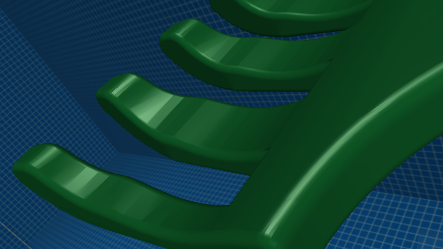
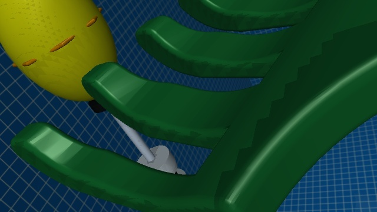

# Hand camera reference fit and coupled alignment

User selected the 40-degree FOV / -15-degree local pitch / -25-degree roll
preview and requested more rotation toward the fork and enlargement.
Applied: same camera position (0.247, -0.044, -0.033 m), 35-degree vertical FOV,
then an additional 12-degree local pan toward the tines. Exact axes are stored
in `uuv_mujoco/current/config/hand_camera_calibration.json`. All four current
map camera copies agree. Vehicle, fork geometry and green material are unchanged.

The visible gap target is (0.48, 0.75). It is a provisional image target, not an
experimentally established insertion contact point. Reference depth at the gap
was approximated from the two adjoining rendered tine surfaces (0.122 m).
The resulting local image Jacobian maps body-right and positive-down movement
to both image coordinates. Its inverse now supplies lateral and depth errors
in the auto-collection runner; defaults remain compatible with the old camera.
The profile is saved with every new run's provenance.

Checks passed: four-map vehicle consistency; five geometric perturbations
(right/left/up/down/combined 1 cm, residual image error below 20% of initial);
ROS-domain-isolated FSM test with both default and new camera parameters;
C++/interface tests (2). This verifies geometry and command generation, not
ArduSub dynamic convergence or physical fork insertion.

Actual test log: `outputs/auto-collection/gui-20260920-093333-28d1e9/`.

The first actual trial was stopped after observing a handoff ordering defect:
front detection expiration could override an available hand observation. v8
checks fresh hand observations before the front-loss branch and holds depth
while accumulating hand confirmation. The isolated ROS regression now expires
the front observation before delivering the first hand observation, and passes.
Follow-up actual trial: `outputs/auto-collection/gui-20260920-093539-e89324/`.

Follow-up observation: frame 380 in sim_20260920T093543Z_e9028065 visibly
contains the white shaft between the tines. Offline inference with the existing
YOLO/best.pt at confidence 0.1 detects only buoy (confidence 0.585), no stick.
The trial was intentionally stopped after identifying this limitation, not
counted as an insertion success. A shaft in view does not establish physical
engagement or release. New-view detector adaptation remains unresolved.

Regression proof: a separately built executable with the handoff ordering fix
removed fails the new isolated ROS test at ALIGN_STICK; the corrected executable
passes. All 3 shared-vehicle scene tests pass, including compiled cameras.

Final status verified by GUI API: automatic collection stopped, armed=false.
