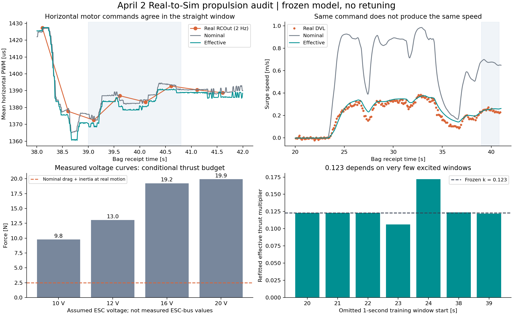

# SIM 과속과 0.123 보정값의 원인 분석 — 2026-09-14

후속: [전압 재생·PWM 기록 보완(2026-09-15)](VOLTAGE_REPLAY_AND_PWM_RECORDING_20260915.md). 사용자가 테더를 넉넉하게 풀었다고 확인해 테더의 조사 우선순위를 낮췄다. 현재는 ESC 공급 조건과 장착 추력 확인을 우선한다.

## 판단

**큰 전후 속도 차이는 단순 TF 이동, 추력 단위 변환, MuJoCo의 추력 중복 적용으로 설명되지 않는다.** 짧은 직진 구간에서 최종 수평 PWM이 거의 일치해도, 기본 물리 모델의 속도가 실물보다 약 2.7배 크다. 차이를 추력·저항·외력의 불일치로 좁혔지만, 현재 자료만으로 실물 추진기 손실과 테더/선체 저항을 각각 식별하지는 못했다.

`0.122933`은 기존 단일 bag에 맞춘 **조건부 유효 계수**다. 실제 추진기 효율이 12.3%라는 의미가 아니다. 이번 분석에서 계수를 다시 선택하거나 기본 물리 프로필에 적용하지 않았다. 독립 Real2Sim 검증이나 VLA 정책의 실물 성공을 주장하지 않는다.



수치 원본: [audit.json](../assets/propulsion-audit-20260914/audit.json). 재현 도구: [audit_rosbag_propulsion.py](../../uuv_mujoco/current/tools/audit_rosbag_propulsion.py).

## 입력이 같은데 속도가 다른 구간

4월 2일 bag의 수신시각 39.0–40.8초를 직진 진단 구간으로 사용했다. 원본 RCOut 4개 패킷, 유효 DVL 16개 샘플이다. 기존 재생의 시뮬 시각을 기록된 시작 시각으로만 옮기고, 추가 위상 탐색이나 크기 보정을 하지 않았다.

| 항목 | 실물 | 기본 물리 + 실물 제어 설정 | 기존 유효 보정 |
|---|---:|---:|---:|
| 전후 속도 중앙값 [m/s] | 0.2472 | 0.6765 | 0.2561 |
| 수평 4채널 PWM RMSE 대 실물 [µs] | — | 3.76 | 10.06 |
| 수평 PWM 최대 차이 [µs] | — | 6.66 | 21.88 |
| 전후 속도 RMSE 대 실물 [m/s] | — | 0.4304 | 0.0166 |
| 재생의 전후 추력 중앙값 [N] | 실측 없음 | 19.623 | 2.540 |

기본 모델의 직진 과속을 RC/조이스틱 배율 차이만으로 설명하기 어렵다. ArduSub는 최종 PWM을 출력하고, 시뮬은 이를 정규화해 추진기 모델에 전달한다. `JS_GAIN_DEFAULT=0.1`을 최종 PWM에 다시 곱하면 별도의 인위적인 축소가 된다.

다만 **전체 주행의 PWM이 일치하는 것은 아니다.** 20–70초 RCOut 100개에서 기본 모델의 수평 채널별 PWM RMSE는 59.50–62.43µs이며, 유효 모델도 35.52–39.92µs다. 회전·자세 피드백이 달라지는 구간까지 입력 오류가 전혀 없다고 일반화하지 않는다. 이번 직진 검사는 큰 과속을 제어 입력 이후 단계에서도 재현할 수 있다는 근거다.

## 추력표와 엔진 적용 검증

제조사 [T200 제품 페이지](https://bluerobotics.com/store/thrusters/t100-t200-thrusters/t200-thruster-r2-rp/)에서 연결한 [2019년 원본 성능표](https://cad.bluerobotics.com/T200-Public-Performance-Data-10-20V-September-2019.xlsx)를 내려받아 코드의 수치와 직접 비교했다.

- 10/12/14/16/18/20V, 각 201개 PWM 지점: **총 1,206개 전부 일치**.
- 원본 kgf에 `9.80665`를 곱한 N값과 저장된 `force_n`의 최대 차이: **0N**. 전류·전력도 원본과 일치.
- 저장된 기본 재생의 추진기 상태값→곡선→gain→잠김→inflow→힘 재구성 오차: 최대 **9.45×10⁻⁸N**.
- 기록된 추진기 월드 합력과 MuJoCo `qfrc_actuator`의 선형 성분 차이: 최대 **2.40×10⁻⁶N**. 출력 정밀도와 방향벡터 정규화 수준의 차이다.
- 별도 MuJoCo 3.8.0 실행에서 직진 구간의 중앙 PWM을 적용했다. 추진기별 힘은 곡선 계산과 일치했고, 합력은 **19.706N**이었다. 일반화 힘의 모멘트 기준점을 변환한 후 `M qacc + bias = actuator + external + passive + constraint` 잔차는 최대 **1.07×10⁻¹⁴**였다. 성분별 단위는 병진 N, 회전 N·m다.
- 전체 6×6 유체 행렬의 전후 부가질량 **3.8105kg**도 활성 상태였다. 로그의 legacy `added_mass=[0,...]`는 부가질량이 사라졌다는 뜻이 아니다. 별도 행렬 모델이 소유한다.

마지막 검사는 완전 잠긴 수평 고정 자세의 실제 엔진 검사다. 새 폐루프 궤적이나 실물 동역학의 정확성을 입증하는 시험은 아니다. 이 검사로 단위/힘 전달과 실제 장착 성능을 구분한다.

부호 처리도 조사했다. 현재 부호는 PWM을 기체의 추진 방향으로 바꾸는 계약이다. 실제 프로펠러 CW/CCW 및 ESC 배선에 따라 PWM 극성과 추진기의 강한 방향 관계가 달라질 수 있다. [제조사 사용 설명](https://bluerobotics.com/learn/thruster-usage-guide/)도 배선 교환과 프로펠러 방향을 구분한다. 따라서 실물 근거 없이 부호를 추력 곡선 뒤로 이동시키는 변경은 하지 않았다. 대신 방향은 유지하고 모든 모터에 약한/강한 측정 곡선을 적용하는 민감도를 계산했다.

## 힘의 차이는 얼마나 큰가

현재 선체 모델은 실물 중앙 속도 0.2472m/s, 정수·수평·완전 잠김 조건에서 전후 항력 **2.683N**을 계산한다. 실물 PWM을 입력한 정적 명목 추력은 다음과 같다.

| 가정한 ESC 전압 | 현재 방향 계약의 명목 추력 [N] | 전부 약한 방향으로 가정 [N] |
|---|---:|---:|
| 10V | 9.77 | 8.77 |
| 12V | 13.05 | 11.59 |
| 16V | 19.24 | 17.04 |
| 20V | 19.91 | 18.24 |

20V에서 약한/강한 방향 전체 가정의 범위는 **18.24–21.61N**이다. 이 직진 구간에서는 정·역방향 곡선 선택만으로 8배 규모의 보정이 설명되지 않는다. 10V는 민감도 시험의 하한이며 실물 전압이라고 주장하지 않는다.

동일 구간의 DVL 속도를 선형 회귀한 기울기 −0.01166m/s²와 기존 유효 질량 18.8105kg를 쓰면, `명목 추력 − 모델 항력 − M·가속도`는 20V에서 약 **17.45N**이다. 이는 **현재 가정에 필요한 미설명 반대 방향 힘**이며, 실제 측정한 테더 장력이 아니다. 추진기가 장착 상태에서 더 약하거나, 선체/테더 저항이 더 크거나, 물살·센서 스케일·실험 조건이 다르면 이 잔차의 해석이 달라진다.

## 이번에 확인한 배터리 데이터 문제

기존 trend 추출기에서 빠졌던 `/battery`, `/mavros/battery`를 추가했다. 각각 2,890개와 1,887개를 별도로 추출하고 수신시각·헤더시각·정확한 ns 시각을 보존한다. 기존 27개 수치 배열과 두 odometry 배열은 이전 추출 결과와 원소별로 동일했다.

| 20–70초 기록 | `/battery` | `/mavros/battery` |
|---|---:|---:|
| 샘플 수 | 1,000 | 650 |
| 전압 최소/중앙/최대 [V] | 19.375 / 21.766 / 22.516 | 0.713 / 21.500 / 22.516 |
| 2V 미만 샘플 | 0 | 150 |
| 20V 초과 샘플 | 984 | 492 |

`/mavros/battery`에는 약 0.7V 계열과 22V 전후 계열이 섞여 있다. 현재 소스의 `dronecan2mavros_battery.py`도 `/battery`와 `/mavros/battery` 양쪽에 발행하므로 다른 MAVROS 배터리 발행자와 충돌할 수 있는 구조다. 다만 bag에는 발행자 식별 정보가 충분하지 않아 모든 패킷의 발행자를 확정하지 않았다. 두 토픽을 합쳐 평균하거나 이 값을 그대로 ESC 전압에 연결하면 잘못된 입력이 된다.

`/battery` 기록은 "실물 배터리가 10–12V여서 추력이 크게 약했다"는 설명을 지지하지 않는다. 그러나 팩 전압과 ESC 단자 전압은 같다고 확인되지 않았다. DC-DC 여부, 배선 강하, ESC 설정은 추가 근거가 필요하다. 현재 곡선이 검증된 범위는 10–20V이므로 21.8V 기록을 20V로 조용히 잘라 넣거나 외삽하지 않았다. 이번 분석에서는 배터리 전압을 물리 모델에 자동 적용하지 않는다.

## 0.123의 식별 한계

기존 학습 구간 7개 중 **20·21·22초의 세 구간은 거의 중립**이다. 실제 추력 정보를 주는 주요 구간은 23·24·38·39초의 네 개 1초 구간이다.

- 한 구간씩 제외한 재계산에서 `k`는 **0.1061–0.1718**로 바뀐다. 24초 구간 하나를 제외하면 약 40% 증가한다.
- 기존 PWM 선형 보간을 마지막 관측 PWM 유지로 바꾸면, 동일 속도·필터·질량·학습 구간에서 **0.1229→0.1399**가 된다.
- 두 보간 방식과 ±0.25초 입력 지연 민감도 전체 범위는 **0.1022–0.1532**다. 이 중 새 계수를 선택하지 않았다.
- 기존 bootstrap의 넓은 범위 `k=0.077–1.101`도 유지한다. 어떤 구간을 다시 뽑는지에 민감하며, 독립 실험의 신뢰구간으로 해석하지 않는다.
- RCOut이 2Hz라 실제 샘플 사이 출력과 현재 모델의 40–60ms 추진기 지연을 분리할 수 없다. 더 높은 지능 설정이나 이미지 생성으로 채울 수 있는 관측 정보가 아니다.

## 현재 우선순위

1. **ESC 전원 및 장착 추력 확인.** 배터리 직결/DC-DC 여부를 확인하고, 가능할 때 실제 사용 PWM 구간에서 장착 상태의 순추력과 ESC 단자 전압을 계측한다. 수평 모터마다 강한 방향과 최종 PWM 부호도 함께 기록한다.
2. **테더·선체 저항 분리.** 같은 자세·속도 조건의 테더 장력 또는 견인/중립 감속 시험이 필요하다. 테더가 연결됐던 실물과 테더를 제거한 진단 모델의 차이를 임의 gain 하나에 몰아넣지 않는다.
3. **독립 반복 실험으로 검증.** 실제 중량·순부력을 기록하고 고율 최종 PWM, DVL, IMU, pressure를 같은 시간축에 저장한다. 식별용 실험과 검증용 실험을 나눠 전진·역진·회전·깊이 응답을 평가한다. DVL 속도의 절대 스케일도 가능하면 외부 거리/시간 기준으로 확인한다.

현재 자료로 확정할 수 있는 것은 **명목 추력과 실물 운동을 설명하는 저항/외력 사이의 큰 불일치**, 그리고 **그 차이를 0.123에 흡수한 모델의 제한된 식별성**이다. 테더만이 원인이라고 확정하거나, 외관 렌더링을 높이면 해결된다고 판단할 근거는 없다.

## 재현 및 검증

프로젝트 루트에서 실행한다. 선택형 `rosbags` 의존성은 기존 오프라인 분석 디렉터리를 사용한다. 원본 bag, 기존 재생, 배포 프로필은 변경하지 않는다. 출력 디렉터리는 새 경로를 지정해야 한다.

```bash
PYTHONPATH=outputs/real-bag-audit-20260911/deps \
  /home/khm/robotics/IsaacLab/isaaclab.sh -p \
  uuv_mujoco/current/tools/extract_rosbag_trends.py \
  --database outputs/real-bag-audit-20260911/bag_2026-04-02_21-46-20/bag_2026-04-02_21-46-20_0.db3 \
  --source_zip '/home/khm/다운로드/bag_2026-04-02_21-46-20.zip' \
  --output_dir outputs/propulsion-audit-20260914/source-rerun

/home/khm/robotics/IsaacLab/isaaclab.sh -p \
  uuv_mujoco/current/tools/audit_rosbag_propulsion.py \
  --source_dir outputs/propulsion-audit-20260914/source-rerun \
  --replay_dir outputs/horizontal-identification-20260912 \
  --performance_xlsx outputs/propulsion-audit-20260914/T200-2019.xlsx \
  --output_dir outputs/propulsion-audit-20260914/audit-rerun
```

공식 XLSX SHA256: `1399b76df7a176cfbb08760c11731199053336e7d92182dece11824c73285085`. Bag DB와 추출 배열, 저장 재생, 프로필, 스크립트 해시는 `audit.json`에 기록한다. 실제 실행 결과는 `outputs/propulsion-audit-20260914/final/`에 보존했다.

검증: 원본 1,206개 추력 지점·전류·전력 대조, 기록된 추력 전달 계약, 실제 MuJoCo 힘/운동방정식 검사, 이전 추출 배열 완전 일치, 기존 T200·trend·distributed 회귀 **46개 통과**, 변경 Python 파일 Ruff 검사 통과. 기존 실험의 GUI/SITL을 재시작하지 않고 수행했다.

연관 분석: [수평 보정](HORIZONTAL_RESPONSE_CALIBRATION_20260912.md), [6월 TF 영향](HISTORICAL_SENSOR_TF_20260625.md), [센서·경로 비교](ROSBAG_TREND_ALIGNMENT.md).
