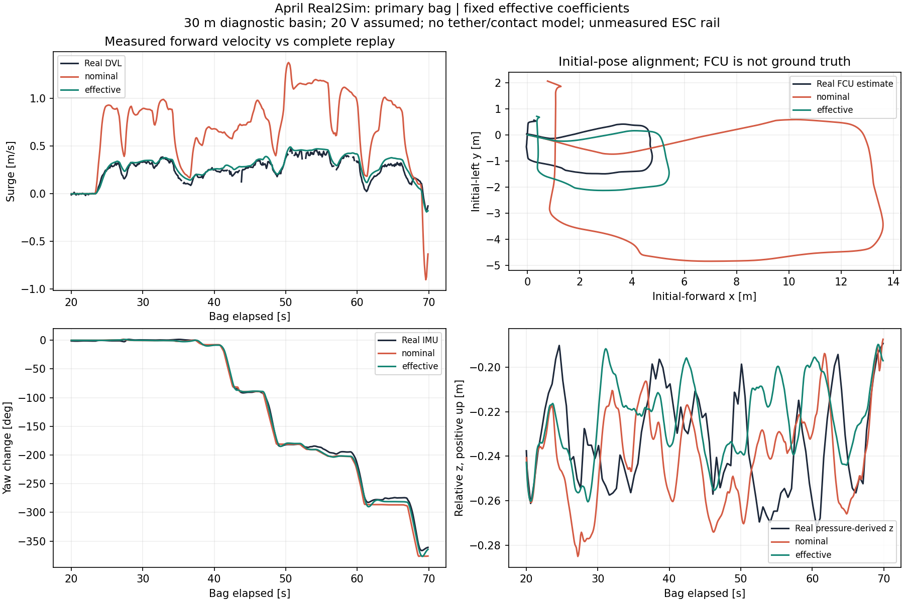
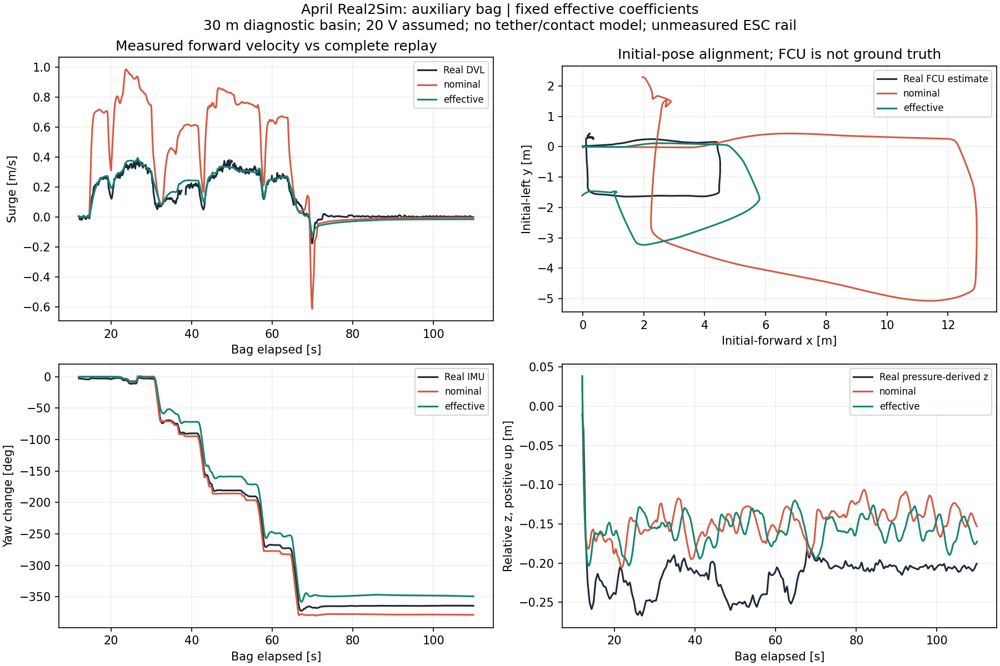

# 확보 자료 기반 Real2Sim 적용 — 2026-09-15

## 적용 결과

4월 2일 **21:46:20 bag(1.3GiB)**을 기준으로 만든 기존 유효 모델을 GUI 실행 경로에 연결했다. 새 기본 선택은 **Course / test tank · April Real2Sim**이다. Tk와 Web GUI, native와 Docker SITL 경로에서 같은 프로필과 검토된 제어 오버레이가 선택된다.

전후 속도 RMSE는 기준 bag에서 **0.505→0.045m/s**, 별도로 보정하지 않은 21:40:11 보조 bag에서 **0.303→0.031m/s**로 감소했다. 이는 실제 ArduSub + ROS + MuJoCo 폐루프 재생 결과다. 이전의 2초 1축 예측 수치와는 다른 평가다.

**보조 bag의 yaw RMSE는 10.25→16.16°로 증가했다.** 전체 6축이나 작업 성공까지 검증된 모델로 표시하지 않는다. 현재는 전후 응답의 유효 보정을 적용한 Real2Sim 버전이며 회전·수심·경로 잔차가 남아 있다.

## 적용한 항목

| 항목 | 실제 적용 |
|---|---|
| 유체 모델 | distributed buoyancy/drag 및 기존 6×6 부가질량 |
| 수평 추진기 공통 유효 계수 | 0.1229331627, 기존 기준 bag 추정값 고정 |
| 전후 normal drag 배율 | 0.7997684968. skin drag를 포함한 완전 잠김 전후 총 제곱 항력 약 35.6843 N·s²/m² |
| 부력 | 1.01배. 사용자의 약한 양성부력 설명에 따른 가정이며 실측 1%가 아님 |
| 유속 | 정수 가정 |
| 전압 | 기존 보정과 함께 검증한 명목 20V. 실제 ESC 단자 전압이 아님 |
| 제어 오버레이 | pitch/roll D=0.009, 수직 가속도 P=0.5, JS gain default=0.1/max=2/steps=4 |
| 수직 추진기 계수 | 기존 1.0. 별도 추력 보정값을 추정하지 않음 |
| 센서·렌더링 | 기존 계약과 경량 표현 사용. 물리 계수 적용에 고비용 렌더링/추가 센서 계산을 넣지 않음 |

`0.123`은 실제 추진기 효율 12.3%를 뜻하지 않는다. 추력·항력·질량·장착 조건 등의 불확실성이 합쳐진 유효값이다. 노션에서 BasicESC R3 구매, 22.2V 배터리 사용과 PM08 팩 계측 근거는 확보했으나 4월 당시 ESC 전원 경로와 장착 추력은 미확인이다. 해당 값을 만들어 넣거나 `/battery` 팩 전압을 ESC 전압으로 자동 연결하지 않았다.

제어 설정은 검토한 7월 18일 tlog 복구본에 근거한다. 4월과 동일 설정이었다고 인증하지 않는다. 모터 방향·조이스틱 gain을 최종 PWM에 중복 곱하지 않으며, 하드웨어 IMU calibration이나 통신 설정을 통째로 복사하지 않는다.

## 실행 경로

- 물리: `uuv_mujoco/current/config/sim_profiles_bag0402_effective.json`의 `bag0402_effective`.
- 제어: `uuv_mujoco/current/config/ardusub_bag0402_replay_overlay.param`.
- 프리셋: `course_real2sim_bag0402`; 활성 코스/수조의 기존 scene을 사용한다.
- 프리셋이 `--profile-file`과 `--fluid-model distributed`를 함께 전달하고, SITL의 `SITL_REAL2SIM_BAG0402=1`을 설정한다. 이전에는 이 프로필이 분석 파일에만 있어 일반 GUI 시작에 반영되지 않았다.
- 검토한 6개 제어값은 오래된 실물 계약 파일과 시뮬 전용 기본값보다 우선한다. 사용자가 명시한 SITL `-P`/`--param`은 기존대로 우선한다.
- 프리셋에서 지정한 물리 파일을 추가 인자로 바꾸는 경우를 거부한다. 무보정 프리셋으로 전환하면 Real2Sim 제어 오버레이도 꺼진다.

```bash
./run_control_gui.sh --web --sim-preset course_real2sim_bag0402 --host 127.0.0.1 --port 8878
```

이미 다른 프리셋을 명시해 실행한 GUI에서는 해당 선택이 유지된다. 새 설정 적용 시 프리셋을 선택하고 시뮬레이션을 시작한다. 이전 동작이 필요하면 `--sim-preset course_current`를 사용한다. pinger 전용 시작 경로는 기존의 별도 제어 계약을 사용한다.

## 실제 폐루프 검증

별도 Docker 컨테이너, ROS domain 91, localhost 통신으로 실제 ArduSub·MAVROS·ROS 추정기·MuJoCo를 실행했다. 실물 연결은 사용하지 않았다. 현재 컨테이너의 MuJoCo는 3.12.0이라 기본/보정 조건 모두 새로 재생했다.

- 기준 bag: 10–73.15초 RC/mode/arm 일정 재생, **20–70초 평가**.
- 보조 bag: 5–110초 일정 재생, **12–110초 평가**. 마지막에 시험을 종료하며 비무장 처리했다.
- 두 모델에 동일한 입력, 검토된 제어 설정, 시작 pose 및 30×30×1.32m 진단 수조를 사용했다. 물리 계수는 추가 bag으로 재학습하지 않았다.
- 넓은 진단 수조는 벽 충돌이 속도 차이를 가리지 않도록 한 시험 환경이며 실물 수조 치수 복원이 아니다. 부표·줄·테더 외력을 제거한 조건이다. 실제 GUI 코스에는 기존 물체가 유지된다.
- 수신시각으로 정렬하고 시작 pose만 맞췄다. 시간 지연 최적화·시간 늘이기·거리 배율 보정은 하지 않았다.
- DVL 무효값과 0.3초 초과 보간 공백은 속도 평가에서 제외했다. XY 기준은 FCU 추정 위치이며 외부 위치 정답이 아니다. 수심은 초기값을 뺀 pressure-derived z와 비교한다.

| bag / 지표 | 기본 모델 | 적용 모델 |
|---|---:|---:|
| 기준 전후 속도 RMSE [m/s] | 0.5054 | **0.0452** |
| 기준 XY 대 FCU 추정 RMSE [m] | 5.3380 | **0.5497** |
| 기준 yaw 변화 RMSE [deg] | 7.4538 | **4.0689** |
| 기준 상대 수심 RMSE [m] | 0.0289 | 0.0302 |
| 보조 전후 속도 RMSE [m/s] | 0.3025 | **0.0308** |
| 보조 XY 대 FCU 추정 RMSE [m] | 4.5713 | **1.6583** |
| 보조 yaw 변화 RMSE [deg] | 10.2521 | **16.1606** |
| 보조 상대 수심 RMSE [m] | 0.0744 | **0.0670** |





기준 bag은 모델 추정에 이미 사용된 자료라 독립 시험이 아니다. 보조 bag의 정지 구간이 전체 RMSE를 낮출 수 있어 전반/후반도 확인했다. 보조 전반 속도 RMSE는 **0.4142→0.0322m/s**, 후반은 **0.1164→0.0294m/s**였다.

보조 bag에서는 회전이 덜 진행되는 구간이 남았고, 종료 yaw 변화는 실물 −364.27°, 적용 모델 −349.29°였다. 기준 bag에서는 실물 −360.70°, 적용 모델 −363.36°다. 따라서 일괄 yaw 보상으로 보조 bag만 맞추지 않았다. Pitch RMSE도 기준 1.08→1.78°, 보조 0.61→1.19°로 증가해 자세 응답의 추가 검증이 필요하다.

## 검사 및 사용 범위

- 기준 2,379개, 보조 3,175개 RC 메시지를 두 모델에 각각 재생했다. 일정에 포함된 RC는 누락·중복 없이 전달됐고 95% 발행 지연은 약 2.37ms였다. 원본 최종 PWM의 약 2Hz 한계와는 다른 지표다.
- FCU 파라미터 readback으로 pitch/roll D, 수직 P, PWM 1100–1900, frame 및 trim을 확인했다. 실행 CSV의 실제 수평 gain=0.122933…, 수직 gain=1, 명목 전압=20V도 확인했다.
- 저장된 GT pose의 환경 접촉은 네 실행 모두 0건, 보수적인 수평 벽 여유는 최소 2.72m 이상이었다. 이는 저장 pose 검사이며 매 순간의 접촉 로그는 아니다.
- T200·distributed·pool·새 프리셋 회귀 **43개 통과**. GUI 시작 계약과 프리셋 계약 검사 통과. 새 물리 파일 보호를 제거하면 해당 회귀가 실패하고 복구 후 통과함을 확인했다.
- 새 기본 프리셋과 실제 GUI 수조 scene으로 초기화하고 headless 물리 루프 진입을 확인했다. 6초 뒤 의도적으로 중단한 초기화 검사이며, GUI 코스 전체 주행의 성능 검증은 아니다. 수정 Python의 Ruff 검사, shell 구문 및 diff 공백 검사도 통과했다.
- GUI 시작 검사에 남아 있던 이전 depth offset 기대값 −0.0536을 현재 센서 계약 0.03286에 맞췄다. 실제 센서 offset 자체를 이번에 변경한 것은 아니다.

이 모델로 시뮬 수집기를 연결하고 전후 동작 중심의 시험 수집을 진행할 수 있다. 기록에는 프리셋 이름과 물리 파일 해시를 남겨야 한다. 횡이동·접촉 작업·다른 전압·다른 속도 영역으로 검증 결과를 확대하지 않는다. 현재 잔차가 있는 yaw·수심·자세를 포함한 데이터는 실물과 일치하는 정답으로 취급하지 않는다.

정확한 수치: [comparison.json](../assets/real2sim-application-20260915/comparison.json).
원본 입력·재생 로그·프로필 snapshot·FCU readback·평가 스크립트는 로컬 `outputs/real2sim-application-20260915/`에 있다. 같은 디렉터리의 `run_cases.py`는 완료 결과 덮어쓰기를 거부한다. Notion 검색·전원 품질·2초 예측 결과는 `outputs/notion-crossbag-20260915/README.md`에 보존했다. 원본 bag은 저장소에 추가하지 않았다.

관련: [기존 수평 보정](HORIZONTAL_RESPONSE_CALIBRATION_20260912.md), [추진 원인 분석](PROPULSION_CAUSE_AUDIT_20260914.md), [전압·고율 PWM 기록](VOLTAGE_REPLAY_AND_PWM_RECORDING_20260915.md).

> 2026-09-15 후속 확인: 별도 SITL JSON clock 반올림 보정 시험에서 보조 yaw RMSE가 16.16° → 2.51°로 개선됐다. 위 기존 실행 수치는 보존하며, 후속 반동 비교 작업에서 해당 clock 보정을 GUI가 사용하는 기본 SITL 바이너리에 설치했다. [현재 검증·적용 상태](YAW_RELEASE_REAL2SIM_20260915.md)를 참고한다. [Yaw 시간 처리 원인 분석](YAW_TIMING_AUDIT_20260915.md)을 참고한다.
