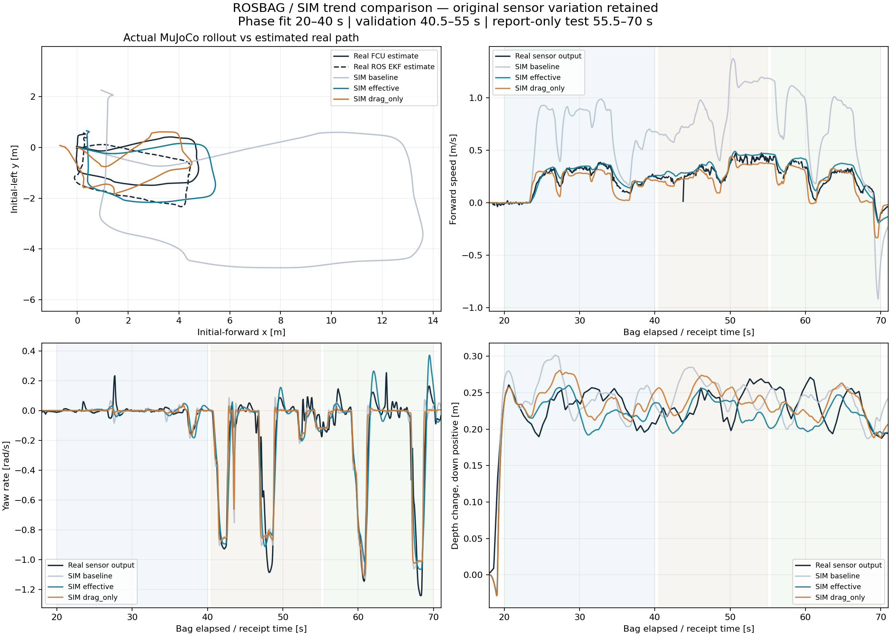
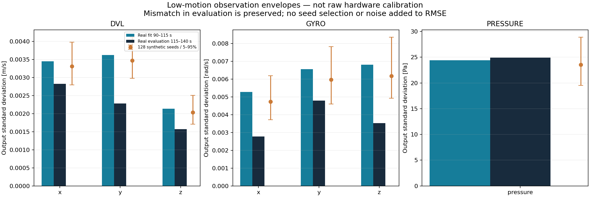

# ROSBAG·형상 기반 경향 비교 — 2026-09-14

4월 2일 실물 bag과 **9월 12일에 저장한 실제 MuJoCo/SITL 폐루프 재생**을 같은 기준으로 다시 비교했다. 새 구현은 원본 SQLite 추출, 수신·헤더 시계 진단, 제한된 위상 보정, 경향/원시 RMSE, 경로 비교와 경험적 노이즈 생성까지 연결한다. 이번 작업에서 새 물리 계수를 적용하거나 실시간 GUI를 재시작하지 않았다.

사용자가 확인한 당시 조건은 **테더 연결, 유사한 추진기, 중성에 가까운 약한 양성부력, 현재와 조금 다른 센서 장착 위치**다. 이전 TF를 실측 정답으로 확정하지는 않는다. 이후 사용자 설명으로 6월 Git의 실물 ROS 설정을 찾아 bag TF와 좌표가 같음을 확인했고, 과거 센서 위치를 참고값으로 넣은 비교도 추가했다. [과거 TF 확인 및 영향 분석](HISTORICAL_SENSOR_TF_20260625.md)에서 baseline 전진 RMSE는 0.48898 → 0.48926 m/s로 거의 변하지 않았다. **센서의 병진 위치 차이는 baseline의 큰 전진 오차를 설명하지 않는다.** 아래 표와 원본 JSON은 최초 비교 결과를 보존한 것이다.

## 현재 비교 결과

아래 값은 보고 전용 55.5–70초 구간에서 경계 양쪽 0.5초를 제외한 유효 표본 기준이다. Trend는 20 Hz 비교 격자에서 7표본 중심 이동평균이다. 원본 신호 RMSE와 평균 편차도 함께 보존한다. 기존 물리 프로필은 이미 이 bag의 일부를 사용해 선택했으므로, 이 구간은 **새 위상 선택에는 미사용이지만 물리 모델의 독립 검증 데이터는 아니다.**

| 물리 조건 | 전진 trend RMSE [m/s] | 전진 상관계수 | yaw-rate trend RMSE [rad/s] | yaw-rate 상관계수 | FCU 추정 경로 XY RMSE [m] |
|---|---:|---:|---:|---:|---:|
| 실물 제어 설정 + 기존 물리 (`baseline`) | 0.4879 | 0.9297 | 0.1169 | 0.9551 | 2.4503 |
| 기존 공동 보정 프로필 (`effective`) | **0.0631** | **0.9251** | **0.0895** | **0.9739** | **0.5917** |
| 항력만 보정 (`drag_only`) | 0.0946 | 0.8739 | 0.1142 | 0.9572 | 0.6183 |

전진의 무보정 모델도 상관계수는 높지만 크기가 크게 틀린다. 따라서 상관계수만으로 통과시키지 않는다. `effective`의 원시 RMSE는 전진 **0.0639 m/s**, yaw rate **0.1035 rad/s**, 상대 수심 **0.0334 m**다. 전진 평균 편차는 +0.0411 m/s다. ROS EKF 추정 경로에 대한 XY RMSE는 0.5570 m다.

수심은 trend 상관계수 **−0.2051**로, 몇 cm 수준의 오차라고 해도 변화 경향이 맞았다고 판단할 수 없다. 압력계 출력을 상대 수심으로 바꾼 실물 신호와 시뮬 body 원점의 수심을 비교한 것으로, 장착 위치·자세·테더·제어 목표의 영향을 분리하지 못한다. 실물 경로 두 개도 FCU/ROS의 **추정값**이며 독립 위치 정답이 아니다.



그림은 평활화 전 신호를 표시한다. 작은 값의 모델을 잘 보이게 하려고 기존 물리의 큰 오차를 잘라내지 않았다. 전체 수치와 입력 해시는 [report.json](../assets/bag-trends-20260914/report.json)에 있다. 이전 보고서의 45–70초 수치와 이번 구간의 수치를 같은 지표로 혼용하지 않는다.

## 시간·위상 계약

- 원본 ZIP SHA256: `195aca87161fb180bc7c7ee0574523f7840399e439f7b1d245313d8d2faf2d52`.
- SQLite SHA256: `e3f60d33dbf72f9c4df223f8afe7e389f8c49ffc6ff7031647ce3da32ec3c154`.
- 위상 fit 20–40초, validation 40.5–55초, 보고 전용 test 55.5–70초. 초기 경로 기준은 10–17초의 위치·yaw 중앙값이다.
- 수신 시각을 기준으로 비교한다. AHRS 약20 Hz, DVL 약9.71 Hz, pressure/depth/RCOut 약2 Hz, FCU odom 약3 Hz다. 이는 수신 간격 중앙값의 역수이며 평균 발행률과 다를 수 있다.
- RCOut의 `receipt − header` 중앙값은 **4294.9685초**다. 이 값을 추진기 지연으로 해석하거나 모든 토픽에 일괄 적용하지 않는다. 비교 도구는 나노초 정수로 각 토픽의 헤더/수신 차이와 역행·중복을 기록한다. RC override에는 헤더가 없으므로 이 진단에서 제외한다.
- 실물 신호 `real(t)`와 모델 `sim(t − lag)` 사이에서 기본 ±0.3초, 0.01초 간격의 상수 offset만 탐색한다. 이 offset은 물리 응답과 필터링을 포함한 **비교용 위상 차이**이지 센서 고유 지연의 식별값이 아니다.
- 훈련 구간의 Huber loss로 후보를 선택하고, validation trend RMSE 2% 이상 개선 및 원시 RMSE 악화 2% 이내를 요구한다. 탐색 경계 최적값과 부족한 excitation은 거절한다. 이 수치는 위상 채택을 위한 절차 기준이며 실물 성능 허용오차가 아니다.
- 모든 후보가 공통으로 지지하는 표본만 비교한다. 무효 DVL, 긴 간격, 외삽을 보간으로 메우지 않는다. 평활화와 위상 탐색이 인접 split을 읽지 않도록 경계를 제외한다. `--max_lag_s`를 늘리면 제외 폭도 증가한다.
- 경로는 초기 평행이동·yaw 회전만 맞춘다. gyro에서 채택한 위상만 공유하고, 경로 자체의 시간 warp·축별 스케일·종점 맞춤은 하지 않는다. 센서별 위상은 진단용이며 수집기의 독립적인 토픽 시간 보정으로 자동 적용하지 않는다.

`effective`의 후보 offset은 전진 −0.15초, yaw −0.22초, 수심 +0.22초였지만 validation에서 충분히 개선되지 않아 **세 신호 모두 추가 offset 0초를 유지**했다. baseline yaw +0.12초, drag-only yaw +0.09초는 검증 기준을 통과했다. 잔차를 더 작은 RMSE로 보이게 하려고 이 결정을 변경하지 않았다.

## 형상과 센서 위치의 처리

저장된 재생의 scene/profile을 읽고, MuJoCo로 컴파일한 body 원점·관성축·sensor site와 프로필의 질량 분포를 비교한다. Docker `/workspace/` 자산 접두사는 파일을 수정하지 않고 메모리 안에서 현재 저장소 경로로 치환한다.

| 항목 | 현재 CAD/프로필 기준값 |
|---|---|
| 질량 구성 | 중앙 6 kg + 좌/우 하부 각4.5 kg = 15 kg (실물 계측값 아님) |
| 구성 질량으로 계산한 COM [m] | (−0.00440, 0, −0.04520) |
| IMU site, body 기준 [m] | (0.13135, 0, 0.08541) |
| DVL site, body 기준 [m] | (−0.00488, 0, −0.15861) |
| 압력계 site, body 기준 [m] | (−0.17364, −0.03034, −0.03286) |
| DVL의 COM 상대 lever arm [m] | (−0.00048, 0, −0.11341) |

강체 위치 효과 `v_sensor = v_COM + omega × lever_arm`을 현재 CAD로만 계산했다. `effective`의 20–70초에서 속도 차이 절댓값 p95는 x **0.00323 m/s**, y **0.00174 m/s**, z **0.000014 m/s**다. 이는 현재 장착 위치에 대한 민감도 예시이며 실제 4월 장착 오차의 상한이 아니다. bag에는 이 TF 보정을 적용하지 않았다. gyro에는 병진 lever arm 보정이 필요 없지만 장착 회전은 여전히 미확정이다. DVL의 전후 x는 기존 축 해석에서 공통인 방향만 사용하고 y/z 축 부호를 오차 최소화로 선택하지 않는다.

MuJoCo BODY-local 속도는 관성 프레임 기준이므로, CSV 해석에 필요한 관성축과 body축 일치를 검사한다. 회전된 관성축이면 조용히 FLU로 간주하지 않고 오류로 종료한다. [MuJoCo 구현 근거](https://github.com/google-deepmind/mujoco/blob/3.12.0/src/engine/engine_core_util.c). 보고서의 컴파일 관성은 runtime override 전 값임을 명시한다.

## 노이즈 참고값과 생성 기능

90–115초 저속·비무장 구간에서 covariance, 표준편차, 인접 차분의 robust sigma와 lag-1 상관을 추출하고, 115–140초의 별도 구간과 비교한다. 잔여 운동·테더·필터 출력도 포함된 **관측 출력의 경험적 변동 범위**다.

| 출력 | fit 표준편차 (x, y, z 순서) |
|---|---|
| DVL [m/s] | 0.00345, 0.00362, 0.00214 |
| AHRS gyro [rad/s] | 0.00529, 0.00655, 0.00680 |
| AHRS accel [m/s²] | 0.03184, 0.04352, 0.02334 |
| pressure [Pa] | 24.42 |

`sample_envelope()`은 seed로 재현되는 평균 0의 다변량 AR(1) 잡음을 생성한다. 축간 covariance와 공통 시간 상관을 사용하며 원본 bag의 노이즈 파형을 복사하지 않는다. 압력은 128개 seed의 평가 구간 표준편차 분포와 대체로 맞지만, DVL·gyro 일부 축과 accel은 구간 간 분산 차이가 남았다. 따라서 전체 센서가 보정 완료됐다고 표시하지 않는다.



```python
# tools 디렉터리를 import path에 둔 오프라인 분석 코드에서 사용
import json
from rosbag_trend_math import sample_envelope

envelopes = json.load(open("outputs/bag-trends-20260914/delivered/observation_envelope.json"))
gyro = envelopes["sensors"]["gyro"]
noise = sample_envelope(gyro, count=1000, seed=42)  # [rad/s], N x 3
dt = gyro["dt_median_s"]  # 이 관측 주기에 맞춰 사용
```

이는 실물 AHRS 출력 약20 Hz의 잡음 모델을 위한 도구다. raw IMU 고율 physics tick이나 DVL beam별 잡음 설정에 동일 수치를 그대로 넣지 않는다. 정지 accel norm 약8.9 m/s² 문제도 중력이나 scale을 강제로 바꿔 숨기지 않았다. 기존 압력 전용 선택형 프로필은 [기존 보정 문서](REAL_BAG_TUNING_20260911.md)를 따른다.

원시 RMSE는 어떤 잡음도 빼지 않은 오차다. `effective`의 전진 잔차는 이 저속 출력 sigma의 약18.5배, yaw는 약15.2배다. 이 비율은 비교용이며 독립 가우시안 오차의 유의성이나 신뢰구간을 뜻하지 않는다. 수심 참고 sigma는 ρ=997 kg/m³, g=9.80665 m/s²로 압력을 환산한 근사값이다.

## 재현 명령과 입력 계약

저장소 루트에서 실행한다. NumPy/SciPy/MuJoCo는 기존 실행 환경을 사용한다. 추출에만 선택형 `rosbags`, 그림 생성에만 `matplotlib`이 필요하며 시뮬 런타임 의존성은 추가하지 않는다. 이 로컬 환경에서는 기존 감사용 rosbags 설치 경로와 IsaacLab Python wrapper를 사용했다.

```bash
export PYTHONPATH="$PWD/outputs/real-bag-audit-20260911/deps${PYTHONPATH:+:$PYTHONPATH}"
export PYTHONPYCACHEPREFIX=/tmp/uuv-trend-20260914
uuv_python=/home/khm/robotics/IsaacLab/isaaclab.sh

"$uuv_python" -p uuv_mujoco/current/tools/extract_rosbag_trends.py \
  --database outputs/real-bag-audit-20260911/bag_2026-04-02_21-46-20/bag_2026-04-02_21-46-20_0.db3 \
  --source_zip /home/khm/다운로드/bag_2026-04-02_21-46-20.zip \
  --output_dir outputs/bag-trends-reproduction/source

"$uuv_python" -p uuv_mujoco/current/tools/compare_rosbag_trends.py \
  --numeric_npz outputs/bag-trends-reproduction/source/numeric.npz \
  --odometry_npz outputs/bag-trends-reproduction/source/odometry.npz \
  --profile_json outputs/bag-trends-reproduction/source/profile.json \
  --source_manifest outputs/bag-trends-reproduction/source/source.json \
  --run baseline=outputs/horizontal-identification-20260912/controller \
  --run effective=outputs/horizontal-identification-20260912/accepted \
  --run drag_only=outputs/horizontal-identification-20260912/drag_fit \
  --output_dir outputs/bag-trends-reproduction/compare

"$uuv_python" -p uuv_mujoco/current/tools/plot_rosbag_trends.py \
  --report_dir outputs/bag-trends-reproduction/compare
```

- 추출기는 **추출된 단일 ROS2 SQLite `.db3`**를 read-only로 열고 무결성을 검사한다. ZIP의 자동 해제, 분할 bag 병합, MCAP 읽기는 수행하지 않는다. decode 오류가 있으면 중단하며, 누락된 packet 이후의 값과 시각을 잘못 짝짓지 않는다.
- 비교의 현재 window preset은 위 ZIP/SQLite 해시의 4월2일 데이터에만 허용한다. 파생 NPZ/JSON도 manifest 해시와 확인한다. 새로운 bag에 사용하려면 우선 해당 bag의 유효 구간과 축 계약을 검토하고 preset을 추가해야 한다.
- `numeric.npz`의 key는 `/`를 `__`로 바꾼 토픽명이다. 값의 0열은 수신 epoch seconds다. IMU 뒤10열은 quaternion xyzw, gyro xyz, accel xyz; DVL 뒤9열은 velocity xyz, altitude, validity, FOM, status, validity time, transmission time; depth/pressure는 뒤1열; RC는 뒤 channels다. 각 토픽의 `__times`는 수신/헤더 epoch seconds, `__times_ns`는 동일한 int64 nanoseconds다. 헤더 없는 RC override의 두 번째 열은 수신 시각과 같다.
- `odometry.npz`는 수신/헤더의 bag-relative seconds, position xyz, quaternion xyzw, linear velocity xyz 순서다. `profile.json`은 전체 토픽의 count/start/end/type과 state 전이이며 `source.json`은 source/derivative 해시와 decode 건수다.
- 각 `--run` 디렉터리는 완료된 `replay.json`, `forces.csv`, `commands.json`, `clearance_tank.xml`, `profiles.json`이 필요하다. 재생의 bag/simulation origin으로 시간축을 연결하고 commands의 실제 profile 이름을 읽는다. shape 검사만 다른 프로필로 해야 할 때 `--sim_profile`을 명시할 수 있다.
- 결과 디렉터리에는 `report.json`, `aligned_signals.npz`, `observation_envelope.json`, `trends.png/svg`, `noise.png`가 생성된다. 추출·비교는 기존 결과 덮어쓰기를 거절한다. 원시 bag와 전체 재생 파일은 Git에 포함하지 않는다.

## 적용 범위와 검증

현재 사용할 물리 후보는 이미 실제 재생으로 확인한 `config/sim_profiles_bag0402_effective.json`의 `bag0402_effective`다. 적용 계수와 재생 환경은 [수평 응답 보정 문서](HORIZONTAL_RESPONSE_CALIBRATION_20260912.md)에 있다. 이번 도구는 새 rollout을 같은 `--run` 형식으로 추가해 변경 전후를 평가할 수 있게 한다. 비교 분석은 오프라인에서만 수행하므로 시뮬 physics/render loop에 연산을 추가하지 않는다.

테더 연결은 확인됐지만 길이·부착점·늘어짐·장력은 알 수 없어 특정 테더 계수를 추정했다고 주장하지 않는다. 현재 1% 양성부력도 계측값이 아닌 가정이다. 기존 유효 수평 계수는 테더를 포함한 여러 실물 차이를 흡수했을 수 있다. 여기에 임의의 큰 테더 항력을 다시 더하면 중복 보정이 된다. 수심을 다음 보정 대상으로 남기고, 수직 제어 목표/장착 위치/양성부력/테더의 영향을 분리할 근거를 확보한 뒤 실제 MuJoCo 재생으로 판정해야 한다.

원본 DB에서 10개 토픽을 오류 없이 추출했고, 이전 감사 결과와 공통 7개 numeric stream이 표본 단위로 일치했다. 세 개의 저장된 실제 rollout을 끝까지 비교하고 그림을 확인했다. 위상 복원·후반 검증 거절·test 정보 차단·무효 데이터 보존·시계 이상·노이즈 covariance/재현성 등 18개 수치 테스트를 CI에 추가했다. 기존 압력·분산 유체·잔차 감쇠·센서 시간 계약 검사를 포함해 로컬 51개가 통과했다. **이번 산출물은 비교·보정 작업 기반이며 수심 보정 완료, 독립 Sim2Real 검증 또는 VLA 학습 성공 판정은 아니다.**
