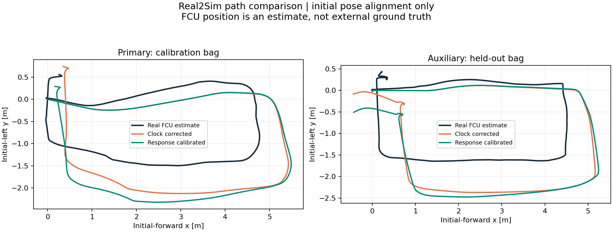
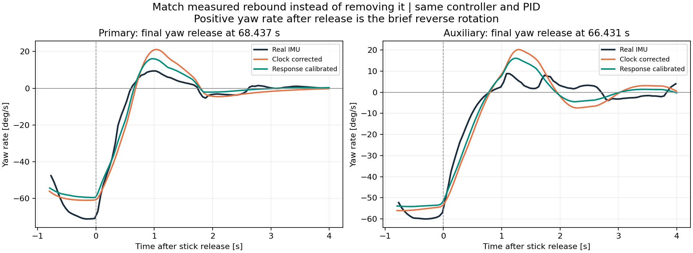

# 실물 수준의 yaw 반동 비교 — 2026-09-15

## 결과와 적용 결정

사용자 목표는 반동을 0으로 만드는 제어 변경이 아니라 **실물 수준의 제동·역회전 응답**이다. 실제 bag에는 작은 역회전이 있으므로 이를 제거하거나 센서 값을 평활화해 감추지 않았다. 동일 PID/RC 입력과 수정된 FCU clock에서 물리 응답 후보를 비교했다.

**HZ만 올려서는 반동이 해결되지 않았다.** 기준 bag에서 추력 갱신 80→400Hz의 마지막 역회전 peak는 21.08→20.88°/s로 거의 같았다. FCU 제어·내부 IMU는 양쪽 모두 400Hz, 물리 계산은 800Hz였다. 800Hz FCU로 실물 400Hz 제어 계약을 변경하는 실험은 하지 않았다.

별도 물리 후보는 두 bag 모두 반동을 줄였지만, 보조 bag의 yaw·경로 오차를 키웠다. 따라서 **기본 April Real2Sim 물리 설정은 유지하고**, 반동 후보는 GUI `Course / test tank · April yaw candidate`에서 명시적으로 선택하는 비교용으로 추가했다. 원래 프리셋/API는 유지했다.

이전에 별도 빌드로만 시험했던 **SITL JSON clock 반올림 수정은 이번에 기본 `ardupilot_sub_stable` 소스와 실행 파일에 설치·재빌드했다.** 실제 제어기/PID/믹서 코드는 바꾸지 않았다. 두 최종 검증 실행은 이 설치된 실행 파일을 사용했다. 기존 원본의 소스 커밋과 진단 로그는 보존돼 있다.

## 경로 그래프

검정은 실물 FCU 위치 추정, 주황은 clock만 보정한 기본 모델, 초록은 반동 보정 후보다. 초기 비무장 위치·yaw만 정렬했다. 경로 자체를 이동·회전 fitting하거나 시간 축을 맞춰 RMSE를 줄이지 않았다. 실물 위치는 외부 측량 ground truth가 아니다.

| 지표 | Clock 보정 기본 | 반동 후보 |
|---|---:|---:|
| 기준 bag 경로 RMSE [m] | 0.5500 | 0.6665 |
| 보조 bag 경로 RMSE [m] | 0.6710 | 0.8621 |
| 기준 bag yaw RMSE [°] | 4.2291 | 2.7621 |
| 보조 bag yaw RMSE [°] | 2.5064 | 5.7532 |
| 기준 bag 전진 속도 RMSE [m/s] | 0.04513 | 0.04358 |
| 보조 bag 전진 속도 RMSE [m/s] | 0.03112 | 0.02985 |
| 기준 bag 상대 수심 RMSE [m] | 0.02973 | 0.02957 |
| 보조 bag 상대 수심 RMSE [m] | 0.06856 | 0.06869 |

후보의 전진 속도와 기준 bag yaw는 좋아졌지만, 경로 전체가 더 정확해진 것은 아니다. 사용자 우선순위에 따라 기본값으로 승격하지 않았다.

## 반동 그래프

| 마지막 해제 후 역회전 최대 각속도 [°/s] | 실물 | Clock 보정 기본 | 반동 후보 |
|---|---:|---:|---:|
| 기준 bag | 9.4320 | 21.0778 | 16.0654 |
| 보조 bag | 8.8591 | 20.2748 | 16.1322 |

- 기준 bag의 3개 해제 구간 각속도 RMSE: **6.1205→3.8526°/s**.
- 보조 bag의 4개 해제 구간 각속도 RMSE: **7.0670→4.7067°/s**.
- 전체 해제 peak의 실물 대비 평균 절대 오차: 기준 **8.0795→4.3574°/s**, 보조 **7.5279→4.3512°/s**.

따라서 반동이 부분적으로 가까워졌지만 실물 수준까지 일치했다고 할 수 없다. 최대 각속도와 반동 구간 전체 RMSE는 다른 지표다. 실물은 약 20Hz IMU 기록, 시뮬 truth는 50Hz force diagnostic 기록을 사용했다. 비교 RMSE는 실물 수신 시각에서 시뮬을 보간했으며 임의 위상 fitting은 하지 않았다.

## 제어 코드와 식별 범위

ArduSub 4.1.2 `ArduSub/control_stabilize.cpp::handle_attitude()`의 기본 경로는 yaw 입력 해제 후 **250ms 동안 rate=0 감속**, 그 뒤 마지막 heading 유지로 전환한다. AltHold도 같은 함수를 호출한다. 이 감속 구간에서 남은 각속도와 추진기/관성/저항의 조합이 이후 역회전에 영향을 준다. 주기를 높인다고 250ms 정책 자체가 바뀌지는 않는다.

실물과 시뮬의 순간 응답 차이는 회전 관성, 회전 저항, 장착 상태의 추진기 가감속·역전 응답, 과거 제어·센서 파라미터 불확실성과 분리해서 확인해야 한다. 이 시험이 그중 하나의 실제 하드웨어 원인을 확정한 것은 아니다. 사용한 제어 snapshot은 7월 자료이며 4월 당시 전체 설정과 동일하다는 추가 증명은 없다. 실물 final PWM 기록도 2Hz여서 ESC 전환을 고유하게 식별할 만큼 빠르지 않다. 테더 저항을 임의 원인으로 넣지 않았다.

## 후보 선정과 독립 검증

기준 bag `21-46-20`의 해제 시각 48.643, 60.890, 68.437s에서 각 2.5s를 비교했다. 다음 조건을 한 번씩 시험한 뒤 기준 bag 지표로만 후보를 선정했다.

| 기준 bag 조건 | 해제 각속도 RMSE [°/s] | 전체 yaw RMSE [°] |
|---|---:|---:|
| Clock 보정 기본, 추력 80Hz | 6.1205 | 4.2291 |
| 추력 400Hz | 6.0873 | 4.1512 |
| 수평 추진기 tau 0.01/0.015s | 5.1013 | 3.4274 |
| yaw 선형 저항 0.6 N·m·s/rad 추가 | 4.5781 | 7.0676 |
| 강체 yaw 관성 scale 0.9→0.8 | 5.1061 | 3.9690 |
| 빠른 추진기 + 관성 0.8 + 저항 0.6 | 3.2812 | 8.1111 |
| **빠른 추진기 + 관성 0.8 + 저항 0.15** | **3.8378** | **2.6994** |

강한 저항 조합은 반동만 보면 좋지만 전체 회전각 오차가 두 배로 커져 제외했다. 마지막 조합은 기준 bag yaw·전진 속도 RMSE를 함께 개선하는 후보 중 해제 RMSE가 가장 작았다. 그 뒤 파일을 고정하고 보조 bag `21-40-11`의 32.053, 45.179, 57.778, 66.431s 해제 응답을 검증했다. 보조 bag 결과를 보고 계수를 재조정하지 않았다. 검증 실패를 숨기지 않고 후보 상태로 유지했다.

최종 실행은 env에 숨겨진 시간 상수 대신 profile 자체에 값을 저장했다. 파일 기반 재실행의 기준 bag 수치가 3.8526/2.7621로 조금 다른 것은 실시간 수신·ROS 실행의 반복 차이다. 최종 표는 배포된 파일과 설치 바이너리로 재생한 수치를 사용한다.

후보 계수는 **조건부 유효 모델**이다. tau 0.01/0.015s는 ESC 실측값이 아니며 빠른 응답 탐색 범위에 가까워 고유한 물리 상수로 해석하면 안 된다. yaw 관성 scale 0.8은 현재 구성의 관성 삼각 부등식을 만족한다. 추가 yaw 저항은 양수라 회전 에너지를 소산한다. 수평 직접 추력 배율 0.122933, 수직 배율 1, 20V 가정, 기존 센서 노이즈 및 PID는 유지했다.

## 코드·실행 적용

- `setup/patch_ardusub_json_clock.py`: 알려진 JSON clock 한 줄만 인식해 적용하는 재현 도구. 미인식 구현은 변경하지 않는다. 소스 패치 후 반드시 SITL을 다시 빌드해야 한다.
- `sim/runtime/thruster_param_runtime_loader.py`: 선택한 profile의 `thruster_response_time_constants`를 파일 기본값 위에 적용한다. 명시적 환경변수 override는 우선하며, 필드가 없는 기존 profile은 기존 동작을 유지한다. 수직 추진기는 건드리지 않는다. 상태·출처·양의 유한 시간 상수를 검증한다.
- `config/sim_profiles_bag0402_yaw_response.json`: 선정된 후보 전체 계수·출처를 고정 저장했다.
- GUI `April yaw candidate`: 비교용 후보이며 `April Real2Sim` 기본값은 유지한다. 기존 viewer/형상/수면 렌더링은 바꾸지 않았다.
- 다음 GUI/SITL 시작부터 설치된 clock 보정 바이너리를 사용한다. 이미 떠 있는 GUI 서버는 새 preset 목록을 읽으려면 서버 재시작이 필요할 수 있다. 이번 검증에서는 실제 GUI·카메라 부하를 실행하지 않았다.

추력 계산을 기본 400Hz로 높이지 않았고 제어/센서 400Hz 계약을 유지했다. 후보는 기존 관성·선형 damping 및 일차 추진기 모델을 사용한다. 새로운 GPU 렌더링이나 외부 패키지는 추가하지 않았다.

## 검증과 재현

- 신규 profile response 통합 회귀는 변경 전 **6개 실패**, 변경 후 **6개 통과**를 확인했다.
- 관련 profile·추진기·분산 저항·수조 테스트 **43개 통과**. GUI 시작 계약과 distributed preset 계약 통과.
- 설치된 FCU DataFlash의 정상 구간은 두 bag 모두 4,000루프/10s, 최대 2,500µs, 지연 루프 0회였다. [원본 counters](../assets/yaw-release-20260915/installed_fcu_timing.json).
- C++ clock 회귀: 원본 44,000프레임 중 8,737프레임의 2,500µs 계약 실패, 반올림 후 0. 원본은 기록된 firmware commit에서 추출하므로 로컬 소스가 이미 수정돼도 재현할 수 있다.
- 실제 최종 두 bag 재생의 기대 RC는 모두 한 번씩 발행했고, 저장 pose에서 수조 접촉이 없었다. 초기 자세 정렬 이외 추가 fitting은 없다. PID/FCU parameter 파일은 기준과 같은지 비교했다.
- [전체 지표](../assets/yaw-release-20260915/full_comparison.json), [해제별 지표와 민감도](../assets/yaw-release-20260915/comparison.json), [선정 기록](../assets/yaw-release-20260915/selection.json), [설치된 SITL 소스 차이·바이너리 SHA256](../assets/yaw-release-20260915/installed_clock_manifest.json).
- 실행 원본: `outputs/yaw-release-real2sim-20260915/`의 `run_cases.py`, `start_stack.py`, `replay.py`, `evaluate.py`, `evaluate_full.py`, `plot_comparison.py` 및 각 case의 `forces.csv`, `replay.json`, `logs/00000001.BIN`.
- 노션은 수정하지 않았다. 테스트용 Docker만 종료했다. Git commit/push는 이번 작업에서 수행하지 않았다.
