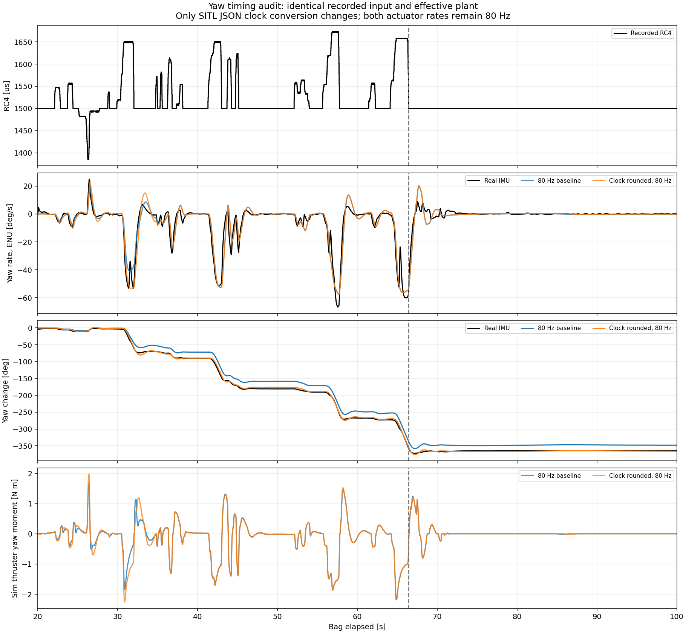

# Yaw 회전 오차: 제어 시간 변환 결함 확인 — 2026-09-15
> 후속 적용: 같은 날 실물 반동 비교 작업에서 기본 `ardupilot_sub_stable`에 clock patch를 설치·재빌드하고 실제 두 bag으로 검증했다. 아래의 “GUI 바이너리 미교체”는 최초 원인 분석 당시 상태다. 현재 적용 상태는 [yaw 응답 검증](YAW_RELEASE_REAL2SIM_20260915.md)을 참고한다.

## 결론

이전의 제어 주기 문제와 관련된 **별도 결함이 남아 있었다**. 기존 9월 8일 수정은 FCU JSON 전달·IMU 측정과 저주기 ROS 발행을 분리했지만, ArduSub 4.1.2의 SITL JSON 시간 변환은 여전히 소수 마이크로초를 잘라냈다. 일부 구간에서 2,500µs 간격이 2,499µs가 되면서 제어기가 다음 센서 프레임까지 기다리고, 실제 루프가 약 4,998–4,999µs로 길어졌다. `SCHED_LOOP_RATE=400`이라는 설정값만으로 시간 계약 충족을 판단하면 안 된다.

PID·추력 배율·관성·유체 계수·노이즈를 고정한 별도 SITL 빌드에서 시간 변환만 반올림으로 바꾸자 보조 bag의 yaw RMSE가 **16.1606° → 2.5064°**, 경로 RMSE가 **1.6583m → 0.6710m**로 줄었다. 시간 문제는 보조 bag의 큰 회전 오차를 상당 부분 설명한다. 실물과 완전히 일치했다는 결과는 아니다.

## 과거 수정과 현재 결함

- 과거 문제: FCU가 400Hz를 가정하는데 상태 전달 100Hz·수신 40Hz·IMU capture 50Hz를 연결해 지속 포화 진동 발생. 9월 8일 수정으로 종료 후 yaw RMS 125.27°/s → 0.40°/s로 개선됐다. 당시 원인/수정 자료는 `outputs/yaw-cause-20260908/원인분석.md`, `outputs/yaw-fix-20260908/수정결과.md`다.
- 현재 production 코드에는 매 물리 단계 PWM 수신, FCU 전달 400Hz, 내부 IMU 400Hz 수정이 존재한다. `/mavros/rc/out` 2Hz는 bag 기록률이며 실제 ESC·제어 루프가 2Hz였다는 뜻이 아니다.
- 최근 재생은 scene/contact guard 때문에 물리 간격이 0.00125s(800Hz), FCU 전달은 400Hz, 추력 갱신은 CLI 기본 80Hz였다. GUI 시간 설정을 넣어도 CAD 접촉 보호가 0.0025s 요청을 0.002s로 제한하고 FCU 정수 분할로 다시 0.00125s가 됐다. 실제 로그값을 기준으로 비교했다.
- ArduSub `libraries/SITL/SIM_JSON.cpp`의 원본은 `time_now_us += deltat * 1.0e6;`이다. 정수 누적기에 실수를 더할 때 반올림하지 않고 잘라낸다. 후보는 `time_now_us += uint64_t(llround(deltat * 1.0e6));` 한 줄이다. 실제 비행제어·믹서·PID 로직은 바꾸지 않았다.

실행 DataFlash `PM`에서 원본 초기 구간은 4,000회 수행에 약 14.07s(약 284Hz), 다음 구간은 약 11.78s(약 339Hz)가 걸렸다. 최대 루프 간격은 약 5,000µs였다. 이후 정상 구간은 4,000회/10s였다. 보정본은 초기 부팅 샘플 1회를 제외한 확인 구간에서 4,000회/10s, 최대 2,500µs, 지연 루프 0회였다. 이 구간 시간은 FCU 내부 시계 기준이며 bag 시각과 그대로 같다고 해석하지 않는다.

## 주기만 높이는 A/B

동일한 보조 bag RC 입력·상태 전환, 동일 effective 모델/20V 가정/PID, 동일 800Hz 물리·400Hz FCU 전달을 사용했다. 원본 파일은 덮어쓰지 않았다.

| 조건 | yaw RMSE [°] |
|---|---:|
| 원본 clock / 추력 80Hz | 16.1606 |
| 동일 80Hz 재시험 | 16.0932 |
| 원본 clock / 추력 100Hz | 15.5149 |
| 원본 clock / 추력 400Hz | 16.2105 |
| GUI 시간 설정: 추력 100Hz, poll 200Hz, ROS 100Hz | 16.1546 |
| **clock 반올림 / 추력 80Hz** | **2.5064** |

따라서 추력 계산 주기만 올리는 방법으로는 이번 오차를 해결하지 못했다. 비싼 400Hz 추력 계산을 기본값으로 올릴 근거도 없다. GUI 조건은 시간 환경변수를 맞춘 headless 시험이며 실제 GUI·카메라 렌더 부하 시험은 아니다.

## 두 bag 검증

| 지표 | 원본 clock | 반올림 clock |
|---|---:|---:|
| 기준 bag yaw RMSE [°] | 4.0689 | 4.2291 |
| 보조 bag yaw RMSE [°] | 16.1606 | 2.5064 |
| 기준 bag 경로 RMSE [m] | 0.5497 | 0.5500 |
| 보조 bag 경로 RMSE [m] | 1.6583 | 0.6710 |
| 기준 bag 전진 속도 RMSE [m/s] | 0.04515 | 0.04513 |
| 보조 bag 전진 속도 RMSE [m/s] | 0.03079 | 0.03112 |
| 기준 bag 상대 수심 RMSE [m] | 0.03019 | 0.02973 |
| 보조 bag 상대 수심 RMSE [m] | 0.06695 | 0.06856 |

RC는 bag 수신 시간에 맞춰 재생했고, 초기 비무장 자세/yaw만 정렬했다. 추가 위상·시간 변형·물리 파라미터 fitting은 하지 않았다. 경로 기준은 실물 FCU 위치 추정치이며 외부 측량 ground truth는 아니다. 평가 구간은 기준 20–70s, 보조 12–110s. 모든 기대 RC 메시지는 한 번씩 발행됐고 p95 발행 지연은 약 2.37ms였다. 저장 pose에서 수조 접촉이 없음을 확인했다. 센서 노이즈와 정상 gyro 변동은 유지했다.

## 회전 종료의 반대 추력은 어떤가

마지막 큰 yaw 입력이 중립으로 돌아오는 시각은 bag 66.431s다. 실물 IMU도 잠깐 반대로 회전한다. 원래 회전을 멈추기 위한 반대 토크와 heading-hold 복귀가 존재하므로 반대 추력 자체를 오류로 제거하면 안 된다.

- 실물의 이후 7s 내 반대 방향 최대 각속도: **8.86°/s**.
- 시뮬: 원본 **20.27°/s**, 시간 보정 후에도 **20.27°/s**. **이 순간 반동의 크기는 시간 보정으로 해결되지 않았다.**
- 마지막 회전 최저각에서 해제 7s 뒤까지 복귀한 각도: 실물 **7.31°**, 원본 시뮬 **8.83°**, 보정 후 **8.73°**. 큰 순간 peak와 누적 복귀각은 다른 지표다.
- 최종 해제 직전 yaw 차이는 원본 **20.63°**, 보정 후 **3.12°**였다. 원본 큰 누적 오차는 이미 해제 전부터 존재했으므로 마지막 반대 추력만 원인으로 지목할 수 없다.
- 75–105s 안정 구간 yaw 속도 RMS는 실물 **0.224°/s**, 원본 **0.184°/s**, 보정본 **0.188°/s**. 관측한 PWM 포화율은 0%다. 과거의 지속 포화 진동은 이번 재생에서 재현되지 않았다.

남은 반동은 yaw 관성·회전 저항·추진기 가감속/역추력 전환·실제 제어 파라미터 차이를 분리해 검증해야 한다. 어떤 하나로 확정할 자료는 아직 없다. 실물 final PWM 기록이 2Hz이므로 수십 ms ESC 전환 지연이나 순간 실제 제동 토크를 이 bag만으로 실측했다고 주장할 수 없다. 테더 저항을 이번 원인으로 가정하지 않았다.

## 수정안과 실행 상태

이번 요청 범위에서는 **원인 확인과 별도 빌드 검증**을 수행했다. 현재 GUI가 사용하는 `ardupilot_sub_stable`의 원본 소스·실행 파일은 교체하지 않았다. 검증된 후보와 한 줄 patch, 바이너리 해시는 아래에 보관했다. 따라서 GUI의 기존 기본 실행에 clock 보정이 적용됐다고 해석하면 안 된다.

- 후보: `outputs/yaw-timing-audit-20260915/firmware_clock_round/build/sitl/bin/ardusub`.
- [한 줄 clock patch](../assets/yaw-timing-20260915/ardusub-json-clock.patch), [원본/후보 해시와 빌드 조건](../assets/yaw-timing-20260915/clock_patch_manifest.json).
- 물리·센서 설정을 다시 fitting하기 전에 검증한 clock 보정을 정식 SITL 빌드에 반영하고, 해당 실행 파일의 해시를 수집기 기록에 포함해야 한다.
- 기존 기본/GUI headless의 추진기 갱신은 유지할 수 있다. 이번 수정은 프레임당 정수 반올림 한 번이며 새로운 렌더링이나 물리 계산을 추가하지 않는다. 정밀 wall-time 성능 benchmark는 수행하지 않았다.

## 재현·검증 자료

- [두 bag 전체 지표](../assets/yaw-timing-20260915/full_comparison.json), [주기 A/B 및 종료 응답](../assets/yaw-timing-20260915/comparison.json), [FCU 실제 loop counters](../assets/yaw-timing-20260915/fcu_timing_summary.json).
- [C++ 시간 변환 회귀 결과](../assets/yaw-timing-20260915/clock_regression.json): 44,000프레임 중 원본 8,737프레임이 2,500µs 계약 실패(return code 42); 같은 검사를 반올림 코드로 실행하면 실패 0(return code 0). 첫 1,250µs 초기 프레임은 검사에서 제외했다.
- 회귀 재현: 저장소 루트에서 `/home/khm/robotics/IsaacLab/isaaclab.sh -p docs/report_sources/20260915_yaw_clock_regression.py`. 실제 원본 JSON 식을 추출해 standalone C++로 컴파일한다. 이는 clock 단위 회귀이며 FCU 전체 동작 증거는 위의 실제 SITL 재생 로그다.
- 기존 IMU timing/publication 회귀 22개 통과. `check_sitl_json_timing_contract.py` 통과. 이 기존 검사들은 새로 찾은 C++ clock 반올림 결함까지는 다루지 않았다.
- 전체 격리 실행: `outputs/yaw-timing-audit-20260915/{run_cases.py,start_stack.py,replay.py,evaluate_full.py,evaluate_timing.py,extract_clock_logs.py}`. `run_cases.py auxiliary_100` 등의 완료 결과는 재실행 시 덮어쓰지 않고 중단한다.
- 원본 source/firmware는 유지했고, Notion은 수정하지 않았다. 테스트용 Docker만 종료했다.
